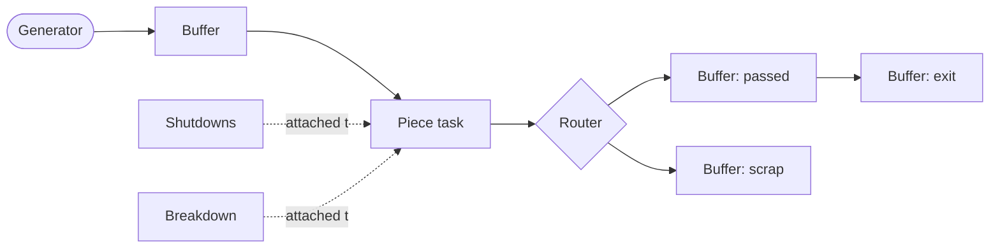

# The Flow Designer, a user guide

The Flow Designer is the app where you build a factory model by drawing it, then run it and look at the results. This guide walks through everything you can do, start to finish, assuming you have never opened it before.

**Read the [simulation guide](simulation.en.md) first.** This guide does not re-explain what a piece, a task, a buffer, an operator, or a shift is. It shows you how to create and connect those things in the app. If a word here is unfamiliar, it is defined in the simulation guide.

---

## 1. The idea in one minute

You build your factory as a diagram. Each station, buffer, and source is a **card** on a canvas. You draw **wires** between the cards to say how pieces flow. You fill in each card's settings by double-clicking it. Some things that are shared across the whole model (the list of product models, the operator teams, the work schedules) live in **registries** rather than on any single card. When the diagram is ready, you press run, watch it go, and then explore the results right on top of your diagram.

That is the whole loop: draw, configure, run, read. The rest of this guide is the detail.

---

## 2. The canvas and getting around

When you open the designer you get a big empty canvas. This is where your model lives.

- **Pan** by dragging the empty background.
- **Zoom** with the mouse wheel.
- **Select** a card by clicking it. Select several by dragging a box around them, or holding the modifier key and clicking each.
- **Move** cards by dragging them. The layout is yours; the simulation does not care where cards sit, only how they are wired.
- **Frame all** (in the Tools menu) zooms out to fit everything on screen. Handy when you lose track of where your cards are.

There is a **Properties** panel that can show a card's raw fields. It starts hidden, which keeps the window clean. You can toggle it from the Tools menu if you ever want it, but you will rarely need it, because every card has a proper settings dialog (below).

---

## 3. Creating cards

The **Create** menu adds a new card to the middle of your current view. There is one entry per card type, and each corresponds directly to a concept from the simulation guide:

| Create menu entry | What it is |
|---|---|
| **Piece generator** | The source of pieces. You need exactly one. |
| **Buffer** | A waiting area, an exit, or a scrap bin (you pick which). |
| **Router** | A probability fork, usually for quality control. |
| **Piece task** | A station that works on pieces. |
| **Resource task** | A station that transforms materials. |
| **Shutdowns** | A planned stop, attached to a task. |
| **Breakdown** | A random failure, attached to a task. |

A brand new card has a name and default settings. You rename it and configure it by double-clicking it, which we cover card by card in section 6.

---

## 4. Wiring cards together

Cards have **ports**: little connection points on their edges. You draw a wire by dragging from an output port of one card to an input port of another. The wire says "pieces (or attachments) flow this way".

The designer only lets you make connections that make sense. You cannot wire a buffer straight into another buffer, or point a breakdown at a generator. If a connection is not allowed, the wire will not stick. This is your first line of defense against building something the simulation cannot run.

The main flows you will draw:

- **Generator to buffer:** where new pieces land.
- **Buffer to task:** a station's input.
- **Task to buffer (or router):** a station's output.
- **Router to buffers:** the branches of a fork.
- **Shutdowns to task, and breakdown to task:** attaching an interruption to the station it affects.

To remove a wire, select it and delete it. To rewire, delete the old wire and draw a new one.

---

## 5. The registries: shared building blocks

Some things are not stations on the line, they are shared definitions used all over the model. These live in the **Registries** menu, not on cards. Set them up early, because your cards will refer to them.

### Models

**Registries, Edit models.** Here you list your product models and their family tree (see the models section of the simulation guide). Each model has a name and, optionally, a parent. Build the hierarchy here once, and every card that needs to talk about models (buffers, task configs, the generator) will offer these names.

### Resources

**Registries, Edit resources.** Your materials. For each one you set its capacity, starting amount, and lifespan, and whether it is restockable (and if so, its threshold, order time, and delivery time). Tasks that consume material point at these.

### Operators

**Registries, Edit operators.** Your teams. For each group you set the number of people, the shifts they work (chosen from the shift registry below), and their productivity. Tasks that need people point at these.

### Shifts

**Registries, Edit shifts.** The work schedules. A shift is either weekly (a repeating pattern across a date range) or custom (explicit date-time intervals). You can attach days off from the closing-days registry. Shifts are used by operators, by the generator, and by tasks, so define the ones you need here.

The shift editor has two conveniences worth knowing:

- **Translate an existing shift:** create a new shift by copying one and shifting it in time. Useful when a second team works the same pattern offset by a few hours.
- **Repeat:** take one shift and automatically duplicate it forward several times with a translation. Instead of hand-building "December 2026", "December 2027", "December 2028", you build it once and say "repeat 2 times, plus 1 year each". Leap years are handled correctly, and each copy keeps its own days off shifted to the right year.

### Closing days

**Registries, Edit closing days.** A shared list of calendar dates that count as closures (public holidays, plant shutdowns). Shifts pick their days off from this list, so a holiday you define once can apply to many shifts.

---

## 6. Configuring each card

Double-click any card to open its settings dialog. Here is what each card's dialog holds. Every setting maps to a concept in the simulation guide, so this section stays brief and points you there for the meaning.

### Piece generator

- **Shifts:** when the generator emits pieces.
- Its outputs (drawn as wires) say which buffers new pieces land in.

Note that *what* the generator emits (the models and their goals or rates) is not set on the card. It lives in **Simulation, Settings**, because it is tied to how the run stops. This surprises people at first, so remember: the generator card sets *when and where*, the simulation settings set *what and how many*.

### Buffer

- **Buffer type:** passage, exit, or scrap.
- **Valid models:** which models this buffer may hold.

### Router

- **Branch probabilities:** for each outgoing buffer, the probability a piece takes that branch. One branch can be marked as the freeloader (takes the leftover probability). Probabilities can be constant or a function of time.

### Piece task

This is the big one. The dialog is organized into the settings from the simulation guide:

- **Model configs:** for each model this task handles, its processing duration and its batch sizes (minimum and maximum carrier capacity), plus any materials it consumes.
- **Task-level durations:** startup and loading.
- **Operators:** the alternatives for startup, loading, and processing, and the operator scope (per batch or per task).
- **Carrier settings:** max capacity, minimum carriers, contiguous, independent.
- **Collector type:** greedy or altruistic, discriminating or not, and the focus-model rule.
- **Timeout, priority, admin flag.**
- **Policies:** the protocol choices (shift constraints, what to do with pending carriers before a stop, self-consciousness, piece exit order). These have sensible defaults; change them only when you need the specific behavior.
- **Task shifts:** when the station is open.

If that looks like a lot, it is, but most stations only need a handful of these changed from their defaults. Start with the model configs and the operators; leave the rest alone until a result tells you to revisit them.

### Resource task

Like a piece task, but instead of piece buffers it has:

- **Non transformed resources:** materials that must be present but are not consumed.
- **Transformed resources:** the materials it consumes, with proportions, and whether each is salvageable.
- **Output resources:** what it produces, with a distribution and bounds.
- **Duration** and the greedy-or-altruistic collector choice.

It shares the operator, carrier, timeout, priority, and shift settings with piece tasks.

### Shutdowns

- **Type:** flexible or non flexible.
- **When:** either explicit intervals (specific date-times) or a generator (every so often, for a duration, across a date range).
- Attach it to a task by wiring it to that task.

### Breakdown

- **Mean time between failures** and **mean time to repair**, each a distribution.
- For a breakdown on a piece task, you must wire its outputs to **lifeboat buffers**: where in-progress pieces go when the station fails. A breakdown on a resource task has no outputs.
- Attach it to a task by wiring it to that task.

---

## 7. Simulation settings

**Simulation, Settings** is where the run-wide choices live:

- **Start date:** the calendar anchor. Minute zero of the simulation is this moment.
- **Seed:** the randomness seed. Same seed, same model, same run. Leave it at 0 unless you want to explore different random outcomes.
- **Stopping criterion:** this is the important one, and it also defines what the generator emits.
  - **By pieces produced (goal mode):** you give each leaf model a target number of good pieces. You set either a manual gap or a grace period for the automatic gap, and a timeout as a safety limit. The run ends when the goal is reached (or the timeout fires).
  - **By time (rate mode):** you give each model a probability (its share of the mix, one can be the freeloader) and a gap between pieces. The run ends at a chosen date.

The relationship to remember, again: the generator card holds the *shifts* (when it can emit); the simulation settings hold the *models and quantities* (what it emits and when the run stops).

---

## 8. Disabling parts of the model

Sometimes you want to test part of your line without the rest, or park a station you are still working on. Select the cards and use **Edit, Disable / enable cards** (or the keyboard shortcut, or the right-click menu).

A disabled card stays on the canvas, greyed out, with its wires intact, but it is completely ignored when you run: the card, its connections, and every reference to it are dropped before the simulation is built. Disable a task and the line is severed there; disable a breakdown and that failure simply does not happen. Select the same cards and toggle again to bring them back.

This is the clean way to run experiments. You are not deleting anything, so nothing is lost, and re-enabling is one click.

---

## 9. Saving, opening, and starting fresh

The **File** menu is the usual set:

- **New:** start an empty model. If your current one has unsaved changes, you are asked first.
- **Open:** load a model from a file. This *replaces* what is on the canvas.
- **Save / Save as:** write your model to a file. The title bar shows a marker when you have unsaved changes.

A model is saved as a single file that holds everything: the cards, the wires, the registries, and the simulation settings. One file is one complete model, so sharing a model is just sharing that file.

---

## 10. Validating before you run

**Tools, Validate graph** checks your model for problems without running it: a task with no input, a buffer no task consumes from, missing operators, probabilities that do not add up, a missing exit buffer, and so on. It lists everything it finds.

You do not have to validate by hand; the designer also validates automatically when you press run and warns you before starting. But running validation yourself while you build is a good habit, because it catches mistakes early, when you still remember what you just changed. Disabled cards are excluded from validation, just as they are excluded from the run.

---

## 11. Running the simulation

**Simulation, Run simulation** (or F5). Here is what happens:

1. The model is saved first, because the run executes the file on disk.
2. It is validated. If there are warnings, you get to decide whether to run anyway.
3. A progress window opens and the run begins.

### Choosing the engine

Under **Simulation, Engine** you pick which engine runs your model:

- **Python:** the reference engine. Always available.
- **C++ (native):** a much faster engine that produces the same results. The app ships with a prebuilt native engine for your platform; if it cannot find one, you can point it at an executable with **Select C++ executable**.

Both engines produce identical outputs (the same files with the same structure), so the choice is purely about speed. For a quick model either is fine; for large or long runs, the native engine is dramatically faster.

### The progress window

While the simulation runs, the window shows a live view: the current simulated date, how many pieces have exited, how far along you are, and the elapsed real time. When the simulation loop finishes, the window switches to a **Generating outputs** phase with a moving bar while it writes the reports, tables, and graphs. This second phase is normal and can take a few seconds on a big run, because it is drawing all the charts.

When everything is done, you get an outcome line (goal reached, stop date reached, and so on), the path to the report folder, and two buttons: **Open report folder** (to see the raw files) and **View results** (to explore them on your diagram, next section).

---

## 12. Reading results on your diagram

Press **View results** after a run, or use **Results, Open run results** to load an older run. This puts the designer into **results mode**, which is the nicest way to read a run.

In results mode:

- The canvas is **locked** (you cannot accidentally edit the model you just ran).
- **Double-click any card** to see its own numbers: a station shows its production and waits, a buffer shows its queue, an operator group shows its occupation.
- A **panel at the bottom** carries the run-wide tables (the overall flow, the model breakdown, and so on).
- A **heat-map** control colors the cards by a metric you choose, so you can spot the bottleneck or the idle station at a glance across the whole line.
- **Exit results mode** (in the Results menu, or the button) returns you to editing.

The diagram you see in results mode is the exact model that ran, so the colors and numbers sit right on top of the stations they describe. This is usually where a problem becomes obvious: the buffer that glows red is sitting in front of your bottleneck.

---

## 13. What a run produces

Every run writes a folder under `runs/`, named with the date and your model's file name. Inside are the reports: a set of CSV files (which open directly in Excel) and a `graphes/` folder of charts. There is also a copy of the exact model that ran, so a results folder is a complete, self-contained record.

At a glance, the folder contains:

- **Per-station numbers:** for every task, its production, its efficiency, and where its time went.
- **Per-buffer numbers:** queue lengths and traffic, which is how you find bottlenecks.
- **Operator and resource numbers:** how busy your people and materials were.
- **Line-wide totals:** pieces out, scrap rate, lead times, work in progress.
- **Charts:** queue lengths over time, occupation over time, per-model trajectories, and more, each saved as both a picture and its underlying data.
- **A run identity file:** the source, the dates, the seed, the compute time, and the stopping criterion, so a run is always reproducible.

That is deliberately a summary. The numbers are worth understanding properly, and the metrics have subtleties (what counts as "produced", why waits do not simply add up, how availability is measured). All of that has its own document: the **[KPI guide](kpis.en.md)**. Read it when you want to interpret a run rather than just launch one.

---

## 14. A first model, end to end

To make it concrete, here is the minimal loop for a first model:

1. **Registries:** define one model, one operator group, and one shift for that group.
2. **Create cards:** a piece generator, an input buffer, one piece task, and an exit buffer.
3. **Wire them:** generator to input buffer, input buffer to task, task to exit buffer.
4. **Configure:** on the buffer, set the type (passage for the input, exit for the last one) and the valid model. On the task, set the model's processing time, its operators, and its shift.
5. **Simulation settings:** pick "by pieces produced", give your model a goal, set a start date.
6. **Validate,** fix anything it flags.
7. **Run,** watch it, then **View results.**

From there you grow the model: add a router and a scrap buffer for quality control, add more stations, add breakdowns and shutdowns, refine the operators. Each addition is the same three steps: create the card, wire it, configure it.

---

## Where to go next

- The concepts behind every setting: the [simulation guide](simulation.en.md).
- Making sense of the numbers a run produces: the [KPI guide](kpis.en.md).
