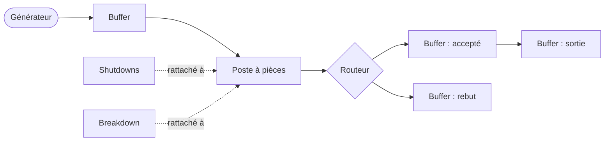

# Le Flow Designer, guide d'utilisation

Le Flow Designer est l'application où vous construisez un modèle d'usine en le dessinant, puis le lancez et regardez les résultats. Ce guide parcourt tout ce que vous pouvez faire, du début à la fin, en supposant que vous ne l'avez jamais ouvert.

**Lisez d'abord le [guide de la simulation](simulation.fr.md).** Ce guide-ci ne réexplique pas ce qu'est une pièce, un poste, un buffer, un opérateur, ou un shift. Il vous montre comment créer et connecter ces choses dans l'application. Si un mot ici vous est inconnu, il est défini dans le guide de la simulation.

---

## 1. L'idée en une minute

Vous construisez votre usine en diagramme. Chaque station, buffer et source est une **carte** sur un canevas. Vous tracez des **fils** entre les cartes pour dire comment les pièces circulent. Vous remplissez les réglages de chaque carte en double-cliquant dessus. Certaines choses partagées par tout le modèle (la liste des modèles produits, les équipes d'opérateurs, les plannings de travail) vivent dans des **registres** plutôt que sur une carte donnée. Quand le diagramme est prêt, vous appuyez sur lancer, vous regardez tourner, puis vous explorez les résultats directement par-dessus votre diagramme.

C'est toute la boucle : dessiner, configurer, lancer, lire. Le reste de ce guide, c'est le détail.

---

## 2. Le canevas et se déplacer

Quand vous ouvrez le designer, vous avez un grand canevas vide. C'est là que vit votre modèle.

- **Se déplacer** en faisant glisser le fond vide.
- **Zoomer** avec la molette.
- **Sélectionner** une carte en cliquant dessus. En sélectionner plusieurs en traçant une boîte autour, ou en tenant la touche de modification et en cliquant chacune.
- **Déplacer** les cartes en les faisant glisser. La disposition est la vôtre ; la simulation se moque de l'endroit où sont les cartes, seul compte comment elles sont câblées.
- **Tout cadrer (Frame all)** (menu Tools) dézoome pour tout faire tenir à l'écran. Pratique quand vous ne savez plus où sont vos cartes.

Il y a un panneau **Properties** qui peut montrer les champs bruts d'une carte. Il démarre caché, ce qui garde la fenêtre propre. Vous pouvez le basculer depuis le menu Tools si vous le voulez, mais vous en aurez rarement besoin, car chaque carte a une vraie boîte de réglages (plus bas).

---

## 3. Créer des cartes

Le menu **Create** ajoute une nouvelle carte au milieu de votre vue courante. Il y a une entrée par type de carte, et chacune correspond directement à un concept du guide de la simulation :

| Entrée du menu Create | Ce que c'est |
|---|---|
| **Piece generator** | La source de pièces. Il en faut exactement une. |
| **Buffer** | Une zone d'attente, une sortie, ou une benne à rebut (vous choisissez). |
| **Router** | Un embranchement par probabilité, généralement pour le contrôle qualité. |
| **Piece task** | Une station qui travaille sur des pièces. |
| **Resource task** | Une station qui transforme des matières. |
| **Shutdowns** | Un arrêt planifié, rattaché à un poste. |
| **Breakdown** | Une panne aléatoire, rattachée à un poste. |

Une carte toute neuve a un nom et des réglages par défaut. Vous la renommez et la configurez en double-cliquant dessus, ce qu'on couvre carte par carte à la section 6.

---

## 4. Câbler les cartes ensemble

Les cartes ont des **ports** : de petits points de connexion sur leurs bords. Vous tracez un fil en glissant d'un port de sortie d'une carte vers un port d'entrée d'une autre. Le fil dit « les pièces (ou les rattachements) circulent par ici ».

Le designer ne vous laisse faire que les connexions qui ont du sens. Vous ne pouvez pas câbler un buffer droit dans un autre buffer, ni pointer une panne sur un générateur. Si une connexion n'est pas permise, le fil ne tient pas. C'est votre première défense contre la construction de quelque chose que la simulation ne peut pas lancer.

Les principaux flux que vous tracerez :

- **Générateur vers buffer :** où atterrissent les nouvelles pièces.
- **Buffer vers poste :** l'entrée d'une station.
- **Poste vers buffer (ou routeur) :** la sortie d'une station.
- **Routeur vers buffers :** les branches d'un embranchement.
- **Shutdowns vers poste, et breakdown vers poste :** rattacher une interruption à la station qu'elle affecte.

Pour retirer un fil, sélectionnez-le et supprimez-le. Pour recâbler, supprimez l'ancien fil et tracez-en un nouveau.

---

## 5. Les registres : les briques partagées

Certaines choses ne sont pas des stations de la ligne, ce sont des définitions partagées utilisées partout dans le modèle. Elles vivent dans le menu **Registries**, pas sur des cartes. Réglez-les tôt, car vos cartes s'y référeront.

### Les modèles

**Registries, Edit models.** Ici vous listez vos modèles produits et leur arbre généalogique (voir la section modèles du guide de la simulation). Chaque modèle a un nom et, éventuellement, un parent. Construisez la hiérarchie ici une fois, et chaque carte qui doit parler de modèles (buffers, configs de postes, le générateur) proposera ces noms.

### Les ressources

**Registries, Edit resources.** Vos matières. Pour chacune vous fixez sa capacité, sa quantité de départ, et sa durée de vie, et si elle est réapprovisionnable (et si oui, son seuil, son temps de commande et son temps de livraison). Les postes qui consomment de la matière pointent vers celles-ci.

### Les opérateurs

**Registries, Edit operators.** Vos équipes. Pour chaque groupe vous fixez le nombre de personnes, les shifts qu'ils font (choisis dans le registre des shifts ci-dessous), et leur productivité. Les postes qui ont besoin de gens pointent vers ceux-ci.

### Les shifts

**Registries, Edit shifts.** Les plannings de travail. Un shift est soit hebdomadaire (un motif qui se répète sur une plage de dates) soit personnalisé (des intervalles date-heure explicites). Vous pouvez y rattacher des jours fériés depuis le registre des jours de fermeture. Les shifts sont utilisés par les opérateurs, par le générateur, et par les postes, donc définissez ici ceux dont vous avez besoin.

L'éditeur de shifts a deux commodités à connaître :

- **Translater un shift existant :** créer un nouveau shift en copiant un et en le décalant dans le temps. Utile quand une seconde équipe fait le même motif décalé de quelques heures.
- **Répéter :** prendre un shift et le dupliquer automatiquement plusieurs fois vers l'avant avec une translation. Au lieu de construire à la main « décembre 2026 », « décembre 2027 », « décembre 2028 », vous le construisez une fois et dites « répéter 2 fois, plus 1 an à chaque fois ». Les années bissextiles sont gérées correctement, et chaque copie garde ses propres jours fériés décalés à la bonne année.

### Les jours de fermeture

**Registries, Edit closing days.** Une liste partagée de dates du calendrier qui comptent comme fermetures (fériés, arrêts d'usine). Les shifts piochent leurs jours fériés dans cette liste, donc un férié défini une fois peut s'appliquer à plusieurs shifts.

---

## 6. Configurer chaque carte

Double-cliquez sur n'importe quelle carte pour ouvrir sa boîte de réglages. Voici ce que contient la boîte de chaque carte. Chaque réglage renvoie à un concept du guide de la simulation, donc cette section reste brève et vous y renvoie pour le sens.

### Piece generator (générateur)

- **Shifts :** quand le générateur émet des pièces.
- Ses sorties (tracées en fils) disent dans quels buffers atterrissent les nouvelles pièces.

Notez que *ce que* le générateur émet (les modèles et leurs objectifs ou débits) ne se règle pas sur la carte. Ça vit dans **Simulation, Settings**, parce que c'est lié à la façon dont l'exécution s'arrête. Ça surprend au début, donc retenez : la carte générateur règle *quand et où*, les réglages de simulation règlent *quoi et combien*.

### Buffer

- **Type de buffer :** passage, sortie, ou rebut.
- **Modèles valides :** quels modèles ce buffer peut contenir.

### Router (routeur)

- **Probabilités de branche :** pour chaque buffer sortant, la probabilité qu'une pièce prenne cette branche. Une branche peut être marquée freeloader (prend la probabilité qui reste). Les probabilités peuvent être constantes ou une fonction du temps.

### Piece task (poste à pièces)

C'est la grosse. La boîte est organisée selon les réglages du guide de la simulation :

- **Configs de modèles :** pour chaque modèle que ce poste gère, sa durée de traitement et ses tailles de lot (capacités minimale et maximale du carrier), plus les matières qu'il consomme.
- **Durées au niveau du poste :** mise en route et chargement.
- **Opérateurs :** les alternatives pour la mise en route, le chargement et le traitement, et le scope opérateur (par lot ou par tâche).
- **Réglages de carrier :** capacité max, carriers minimum, contigus, indépendants.
- **Type de collecteur :** greedy ou altruiste, discriminant ou non, et la règle de modèle focus.
- **Timeout, priorité, drapeau admin.**
- **Politiques :** les choix de protocoles (contraintes de shift, quoi faire des carriers en attente avant un arrêt, self-consciousness, ordre de sortie des pièces). Elles ont des défauts sensés ; ne les changez que quand vous avez besoin du comportement précis.
- **Shifts du poste :** quand la station est ouverte.

Si ça paraît beaucoup, ça l'est, mais la plupart des stations n'ont besoin que d'une poignée de ces réglages changés par rapport aux défauts. Commencez par les configs de modèles et les opérateurs ; laissez le reste tranquille jusqu'à ce qu'un résultat vous dise d'y revenir.

### Resource task (poste à ressources)

Comme un poste à pièces, mais au lieu de buffers de pièces il a :

- **Ressources non transformées :** des matières qui doivent être présentes mais ne sont pas consommées.
- **Ressources transformées :** les matières qu'il consomme, avec des proportions, et si chacune est récupérable.
- **Ressources de sortie :** ce qu'il produit, avec une loi et des bornes.
- **Durée** et le choix de collecteur greedy ou altruiste.

Il partage les réglages d'opérateurs, de carrier, de timeout, de priorité et de shift avec les postes à pièces.

### Shutdowns (arrêt programmé)

- **Type :** flexible ou non flexible.
- **Quand :** soit des intervalles explicites (dates-heures précises), soit un générateur (tous les tant de temps, pour une durée, sur une plage de dates).
- Rattachez-le à un poste en le câblant à ce poste.

### Breakdown (panne)

- **Temps moyen entre pannes** et **temps moyen de réparation**, chacun une loi.
- Pour une panne sur un poste à pièces, vous devez câbler ses sorties vers des **buffers canot de sauvetage** : où vont les pièces en cours quand la station tombe. Une panne sur un poste à ressources n'a pas de sorties.
- Rattachez-la à un poste en la câblant à ce poste.

---

## 7. Les réglages de simulation

**Simulation, Settings** est l'endroit où vivent les choix qui touchent toute l'exécution :

- **Date de début :** l'ancre du calendrier. La minute zéro de la simulation est ce moment.
- **Graine (seed) :** la graine d'aléatoire. Même graine, même modèle, même exécution. Laissez-la à 0 sauf si vous voulez explorer différentes issues aléatoires.
- **Critère d'arrêt :** c'est le point important, et il définit aussi ce que le générateur émet.
  - **Par pièces produites (mode objectifs) :** vous donnez à chaque modèle feuille un nombre cible de bonnes pièces. Vous fixez soit un gap manuel, soit une période de grâce pour le gap automatique, et un timeout comme limite de sécurité. L'exécution finit quand l'objectif est atteint (ou que le timeout se déclenche).
  - **Par le temps (mode débit) :** vous donnez à chaque modèle une probabilité (sa part du mélange, l'une peut être le freeloader) et un gap entre pièces. L'exécution finit à une date choisie.

La relation à retenir, encore : la carte générateur tient les *shifts* (quand il peut émettre) ; les réglages de simulation tiennent les *modèles et quantités* (ce qu'il émet et quand l'exécution s'arrête).

---

## 8. Désactiver des parties du modèle

Parfois vous voulez tester une partie de votre ligne sans le reste, ou mettre de côté une station encore en travaux. Sélectionnez les cartes et utilisez **Edit, Disable / enable cards** (ou le raccourci clavier, ou le menu clic droit).

Une carte désactivée reste sur le canevas, grisée, avec ses fils intacts, mais elle est complètement ignorée à l'exécution : la carte, ses connexions, et toute référence à elle sont retirées avant que la simulation soit construite. Désactivez un poste et la ligne est coupée là ; désactivez une panne et cette défaillance n'a simplement pas lieu. Sélectionnez les mêmes cartes et rebasculez pour les ramener.

C'est la façon propre de faire des expériences. Vous ne supprimez rien, donc rien n'est perdu, et réactiver est un clic.

---

## 9. Sauvegarder, ouvrir, et repartir de zéro

Le menu **File** est l'ensemble habituel :

- **New :** démarrer un modèle vide. Si le courant a des changements non sauvegardés, on vous demande d'abord.
- **Open :** charger un modèle depuis un fichier. Ça *remplace* ce qui est sur le canevas.
- **Save / Save as :** écrire votre modèle dans un fichier. La barre de titre montre un marqueur quand vous avez des changements non sauvegardés.

Un modèle est sauvegardé comme un seul fichier qui contient tout : les cartes, les fils, les registres, et les réglages de simulation. Un fichier est un modèle complet, donc partager un modèle, c'est juste partager ce fichier.

---

## 10. Valider avant de lancer

**Tools, Validate graph** vérifie votre modèle pour des problèmes sans le lancer : un poste sans entrée, un buffer dont aucun poste ne consomme, des opérateurs manquants, des probabilités qui ne tombent pas juste, un buffer de sortie manquant, et ainsi de suite. Il liste tout ce qu'il trouve.

Vous n'avez pas à valider à la main ; le designer valide aussi automatiquement quand vous appuyez sur lancer et vous avertit avant de démarrer. Mais lancer la validation vous-même pendant que vous construisez est une bonne habitude, car ça attrape les erreurs tôt, quand vous vous souvenez encore de ce que vous venez de changer. Les cartes désactivées sont exclues de la validation, tout comme elles sont exclues de l'exécution.

---

## 11. Lancer la simulation

**Simulation, Run simulation** (ou F5). Voici ce qui se passe :

1. Le modèle est sauvegardé d'abord, car l'exécution exécute le fichier sur le disque.
2. Il est validé. S'il y a des avertissements, vous décidez de lancer quand même ou non.
3. Une fenêtre de progression s'ouvre et l'exécution démarre.

### Choisir le moteur

Sous **Simulation, Engine** vous choisissez quel moteur fait tourner votre modèle :

- **Python :** le moteur de référence. Toujours disponible.
- **C++ (native) :** un moteur bien plus rapide qui produit les mêmes résultats. L'application est livrée avec un moteur natif préconstruit pour votre plateforme ; s'il n'en trouve pas, vous pouvez pointer vers un exécutable avec **Select C++ executable**.

Les deux moteurs produisent des sorties identiques (les mêmes fichiers avec la même structure), donc le choix ne porte que sur la vitesse. Pour un modèle rapide, l'un ou l'autre convient ; pour de grandes ou longues exécutions, le moteur natif est radicalement plus rapide.

### La fenêtre de progression

Pendant que la simulation tourne, la fenêtre montre une vue en direct : la date simulée courante, combien de pièces sont sorties, où vous en êtes, et le temps réel écoulé. Quand la boucle de simulation finit, la fenêtre bascule vers une phase **Generating outputs** avec une barre qui va et vient pendant qu'elle écrit les rapports, tableaux et graphes. Cette seconde phase est normale et peut prendre quelques secondes sur une grosse exécution, car elle dessine tous les graphiques.

Quand tout est fini, vous avez une ligne de résultat (objectif atteint, date d'arrêt atteinte, etc.), le chemin du dossier de rapport, et deux boutons : **Open report folder** (voir les fichiers bruts) et **View results** (les explorer sur votre diagramme, section suivante).

---

## 12. Lire les résultats sur votre diagramme

Appuyez sur **View results** après une exécution, ou utilisez **Results, Open run results** pour charger une exécution plus ancienne. Ça met le designer en **mode résultats**, la plus belle façon de lire une exécution.

En mode résultats :

- Le canevas est **verrouillé** (vous ne pouvez pas éditer par accident le modèle que vous venez de lancer).
- **Double-cliquez sur n'importe quelle carte** pour voir ses propres chiffres : une station montre sa production et ses attentes, un buffer montre sa file, un groupe d'opérateurs montre son occupation.
- Un **panneau en bas** porte les tableaux qui touchent toute l'exécution (le flux global, la répartition par modèle, etc.).
- Un contrôle de **carte de chaleur (heat-map)** colore les cartes selon un indicateur que vous choisissez, pour repérer le goulot ou la station inactive d'un coup d'œil sur toute la ligne.
- **Exit results mode** (menu Results, ou le bouton) vous ramène à l'édition.

Le diagramme que vous voyez en mode résultats est exactement le modèle qui a tourné, donc les couleurs et les chiffres se posent pile sur les stations qu'ils décrivent. C'est souvent là qu'un problème devient évident : le buffer qui rougeoie est posté devant votre goulot.

---

## 13. Ce qu'une exécution produit

Chaque exécution écrit un dossier sous `runs/`, nommé avec la date et le nom de fichier de votre modèle. Dedans il y a les rapports : un ensemble de fichiers CSV (qui s'ouvrent directement dans Excel) et un dossier `graphes/` de graphiques. Il y a aussi une copie du modèle exact qui a tourné, donc un dossier de résultats est un enregistrement complet et autonome.

D'un coup d'œil, le dossier contient :

- **Des chiffres par station :** pour chaque poste, sa production, son efficacité, et où est parti son temps.
- **Des chiffres par buffer :** longueurs de file et trafic, la façon de trouver les goulots.
- **Des chiffres d'opérateurs et de ressources :** à quel point vos gens et vos matières ont été sollicités.
- **Des totaux sur toute la ligne :** pièces sorties, taux de rebut, temps de traversée, encours.
- **Des graphiques :** longueurs de files dans le temps, occupation dans le temps, trajectoires par modèle, et plus, chacun sauvé à la fois en image et en données sous-jacentes.
- **Un fichier d'identité de l'exécution :** la source, les dates, la graine, le temps de calcul, et le critère d'arrêt, pour qu'une exécution soit toujours reproductible.

C'est volontairement un résumé. Les chiffres valent la peine d'être compris pour de vrai, et les indicateurs ont des subtilités (ce qui compte comme « produit », pourquoi les attentes ne s'additionnent pas simplement, comment la disponibilité est mesurée). Tout ça a son propre document : le **[guide des KPI](kpis.fr.md)**. Lisez-le quand vous voulez interpréter une exécution plutôt que juste en lancer une.

---

## 14. Un premier modèle, de bout en bout

Pour rendre ça concret, voici la boucle minimale d'un premier modèle :

1. **Registres :** définir un modèle, un groupe d'opérateurs, et un shift pour ce groupe.
2. **Créer les cartes :** un générateur de pièces, un buffer d'entrée, un poste à pièces, et un buffer de sortie.
3. **Les câbler :** générateur vers buffer d'entrée, buffer d'entrée vers poste, poste vers buffer de sortie.
4. **Configurer :** sur le buffer, régler le type (passage pour l'entrée, sortie pour le dernier) et le modèle valide. Sur le poste, régler le temps de traitement du modèle, ses opérateurs, et son shift.
5. **Réglages de simulation :** choisir « par pièces produites », donner un objectif au modèle, régler une date de début.
6. **Valider,** corriger ce qu'il signale.
7. **Lancer,** regarder, puis **View results.**

À partir de là, vous faites grossir le modèle : ajouter un routeur et un buffer de rebut pour le contrôle qualité, ajouter plus de stations, ajouter des pannes et des arrêts, affiner les opérateurs. Chaque ajout, ce sont les mêmes trois étapes : créer la carte, la câbler, la configurer.

---

## Où aller ensuite

- Les concepts derrière chaque réglage : le [guide de la simulation](simulation.fr.md).
- Donner du sens aux chiffres qu'une exécution produit : le [guide des KPI](kpis.fr.md).
