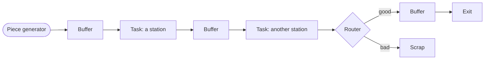
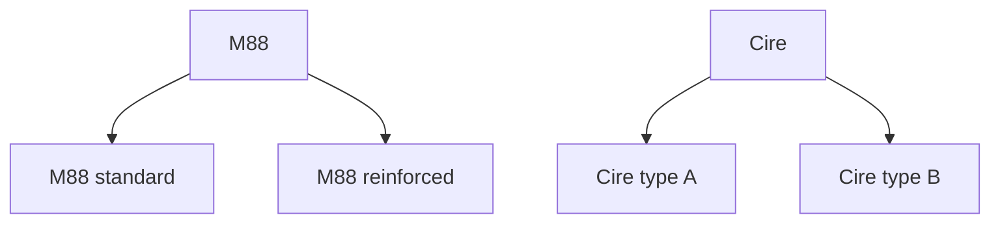
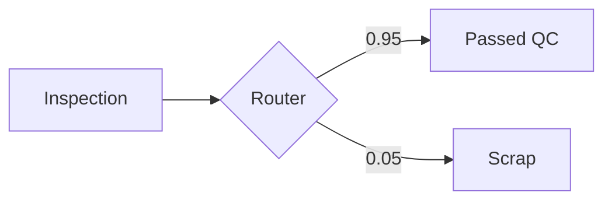
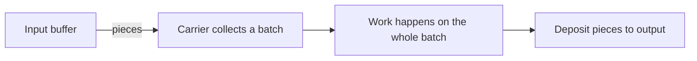
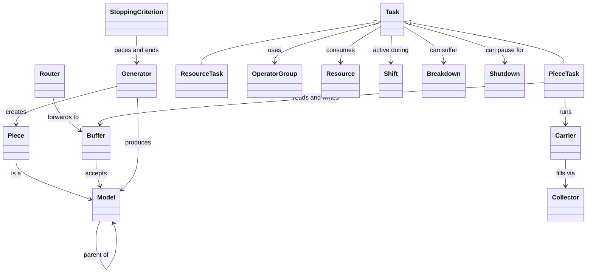
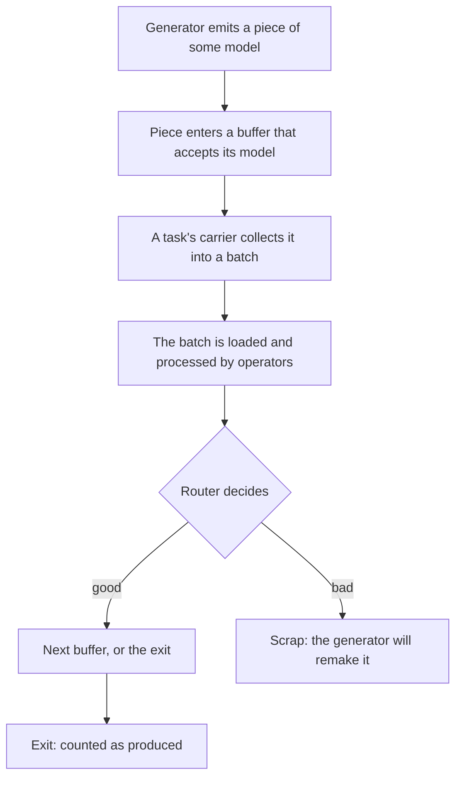

# The Simulation, explained

This document explains how the simulation works, in plain language. It is for anyone who wants to understand what the model actually does: what a piece is, what a task is, what all those settings mean, and why the results come out the way they do. You do not need to read the code.

If you are going to use the Flow Designer, read this first. The designer is just a friendly way to build and run this model, and it uses the same words for everything (piece, task, buffer, operator, and so on). Once you understand the concepts here, the [Flow Designer guide](flow-designer.en.md) will make sense right away.

A note on vocabulary: the model was built for a real workshop (a wax injection and investment casting atelier), so the examples lean on that world. But nothing here is specific to wax. A "piece" could be a car door, a circuit board, or a cake. If it moves through stations and gets worked on, this model can represent it.

---

## 1. The big picture

Think of a factory line. Raw pieces appear at one end, travel through a series of stations where machines and people work on them, and finished pieces come out the other end. Some pieces get scrapped along the way. That is the whole thing.

Every box in that picture is a concept you will meet below. The arrows are the path pieces take. The rest of this document walks through each box, roughly in the order a piece meets them.

Two ideas hold the whole thing together:

- **Everything happens in simulated time.** The clock inside the simulation is measured in minutes. A two year run is about 1,050,000 minutes. The simulation jumps from event to event (a piece arriving, a machine finishing) rather than ticking one minute at a time, which is why it can simulate two years in a few seconds.
- **The calendar is real.** You give the simulation a start date, and every minute maps back to a real date and time. So when a report says a piece finished on "15-01-2026 14:05", that is a genuine calendar moment, counted forward from the start.

---

## 2. Pieces and models

A **piece** is one physical item moving through the line. It is born at the generator, it travels, and it eventually exits or gets scrapped.

A **model** is the *type* of a piece. Think of it as the product reference. Two pieces of model "M88" are interchangeable; a piece of model "LEAP" is a different product that may follow a different path and take different times.

Models can have a **parent**, which creates a family tree. This is genuinely useful. Suppose you have "M88 standard" and "M88 reinforced" as two children of a parent "M88". A station that is configured to accept "M88" will accept both children automatically, because the model knows its ancestors. You configure the general case once, and the specific variants inherit it. A station can also be configured for just one child if that child needs special treatment.

The models with no children are the **leaf models**. Those are the only ones a generator actually produces, because a real piece is always a specific variant, never the abstract family. The parent models exist so you can talk about groups.

---

## 3. Where pieces wait: buffers and routers

Between stations, pieces sit in **outlets**. There are two kinds of outlet: buffers and routers.

### Buffers

A **buffer** is a waiting area. Pieces arrive, queue up, and wait for the next station to pick them. Every buffer has a list of **valid models**: the model types it is allowed to hold. A piece can only enter a buffer that accepts its model.

Buffers come in three types, and the type decides what the buffer *means*:

| Buffer type | What it is | What happens to pieces there |
|---|---|---|
| **Passage** | A normal waiting area between stations | Pieces wait, then a downstream task takes them |
| **Exit** | The finish line | A piece here is done and counted as produced. There is exactly one exit buffer in a model. |
| **Scrap** | The reject bin | A piece here is thrown away. It leaves the line for good. |

The exit and scrap buffers are special because pieces never leave them. They are end states. Everything else is a passage buffer where pieces are just passing through.

### Routers

A **router** is a fork in the road. When a piece would enter a router, the router immediately sends it onward to one of several buffers, chosen by probability. It does not hold pieces; it decides and forwards in the same instant.

The classic use is quality control. After an inspection station, a router sends 95% of pieces to the "passed" buffer and 5% to the scrap buffer:

One branch of a router can be the **freeloader**: instead of a fixed probability, it takes "whatever is left over". If you set one branch to 0.05 and mark the other as the freeloader, the freeloader gets 0.95 automatically. This saves you from having to make the numbers add up to exactly 1 by hand, and it keeps working if you later change the 0.05.

Probabilities can also change over time (more on that idea in the section on time functions), so you can model a process that drifts, for example a scrap rate that creeps up as tooling wears.

---

## 4. Tasks: the stations

A **task** is a station on the line: a place where work happens. This is the richest concept in the model, so we will build it up slowly.

There are two kinds of task, and they differ in *what flows through them*:

- A **piece task** works on pieces. Pieces come in from input buffers, get worked on, and go out to output buffers. Injection, marking, inspection, and storage are all piece tasks.
- A **resource task** works on materials, not pieces. It consumes raw material and produces more of another material. Think of a station that melts wax pellets into liquid wax, or mixes a batch of ceramic slurry. No individual "piece" flows through; quantities of stuff do.

Most of a factory is piece tasks. Resource tasks are the supporting cast that keep the consumables topped up. We will focus on piece tasks first, then cover what is special about resource tasks.

### The carrier: the unit of work

Here is the single most important idea for understanding tasks. A task does not work on one piece at a time in isolation. It works in **batches**, and the thing that carries a batch is called a **carrier**.

Picture a tray, or an oven rack, or a basket. The carrier is that tray. It collects some pieces, holds them together while the station works on the whole group at once, and then drops them off. A carrier is born empty, fills up with pieces, goes through the work, and deposits its pieces at the end.

Why batches and not single pieces? Because real stations work that way. An oven bakes a full rack. An inspector might check pieces one at a time (a batch of one), but a curing step might handle forty at once. The carrier is how the model captures "how many pieces get processed together".

A single task can run **several carriers at the same time** if you let it. That models a station where multiple trays can be in progress at once, like a big waiting area where many groups of pieces sit curing in parallel. More on that when we reach the capacity settings.

### The life of a carrier

A carrier goes through the same stages every time. Understanding these stages is the key to reading the outputs later, because the reports measure exactly how long carriers spend in each one.

1. **Startup.** Before the station can work, it may need to warm up or be set up. An oven preheats; a machine gets calibrated. This happens once when the station wakes up, and again after any interruption or at the start of a new shift.
2. **Collect.** The carrier gathers its pieces from the input buffers. It waits until it has enough (or until it runs out of patience, see timeout below). This is where a starving station loses time: no pieces to collect means the carrier just waits.
3. **Load.** The gathered pieces are loaded onto the station. This takes time and usually needs an operator.
4. **Process.** The actual work: baking, cutting, injecting. This takes time (which can depend on the model) and may need an operator and some material.
5. **Deposit.** The finished pieces are dropped into the output buffers, and the carrier is done.

If the station gets interrupted mid work (a breakdown, a scheduled stop, or the end of a shift), the carrier may be aborted and its pieces returned to wait, depending on the policies you set. That is covered in the interruptions section.

### Collectors: how a carrier decides what to grab

The **collector** is the part of the carrier that does step 2, the collecting. It decides which pieces to pick and when to stop waiting. This is where a lot of the model's subtlety lives, so it has its own section below (section 6, on collector types). For now, just hold onto the idea: the collector is the logic that fills the tray.

---

## 5. The task settings, one by one

When you configure a piece task, you set a number of values. Here is what each one means, grouped so they make sense together.

### Batch size: how many pieces per carrier

These settings are per model, because different products may batch differently.

- **Minimum carrier capacity.** The smallest batch the carrier will accept before it starts working. If this is 4, the carrier waits until it has at least 4 pieces (or times out). Set it to 1 and the station works on whatever it can get, one piece at a time if that is all there is.
- **Maximum carrier capacity.** The largest batch the carrier will hold. If this is 4, the tray is full at 4 and will not take a fifth.

An oven that bakes racks of 4 would use minimum and maximum both at 4 (always a full rack), or minimum 1 and maximum 4 (start with whatever is available, up to a full rack).

### Capacity: how many carriers at once

- **Max capacity.** The total number of piece slots the station has, across all its carriers running at the same time. This is the setting that decides how much parallelism the station has. If max capacity is 4 and each carrier holds 4, only one carrier runs at a time. If max capacity is 40 and each carrier holds 4, up to 10 carriers can run in parallel. A big storage or curing area uses a large max capacity; a single serial machine uses a max capacity equal to one carrier.
- **Minimum carriers.** How many carriers must be ready to launch together as a "wave". Usually 1. If you set it higher, carriers wait for each other before any of them starts, which models a station that only runs when it has a full set of trays.

There is a rule the model enforces: max capacity must be at least as large as a carrier needs, or the carriers can never assemble their batch and the station deadlocks. The designer checks this for you.

### Contiguous and independent carriers

These two switches change how carriers share the station's capacity.

- **Contiguous carriers.** This decides whether a carrier reserves its full maximum footprint up front, or only takes space for the pieces it actually holds. With contiguous carriers off, a carrier that is allowed up to 4 pieces reserves 4 slots even while it is still collecting, so the reserved-but-empty slots are not available to others. With it on, the carrier only occupies what it currently holds. This matters mostly for how the "places occupied" graph reads and for whether many small carriers can pack into a station.
- **Independent carriers.** This decides whether carriers run on their own timelines or in lockstep. Independent carriers each go through their own startup, collect, load, process cycle whenever they are ready. This is the model for a big parallel waiting area where each tray does its own thing. Non independent carriers move together as a group.

If this feels abstract, that is fine. Most ordinary stations use one carrier at a time and you can leave these at their simple defaults. The switches exist for the special stations: large parallel storage areas, curing zones, waiting rooms.

### Durations

Three separate times, each configured as a probability distribution (see section 10 on randomness) so they can vary realistically run to run:

- **Startup duration.** How long the warm up or setup takes.
- **Loading duration.** How long it takes to load a batch onto the station.
- **Processing duration.** The actual work time. This one is set *per model*, because a reinforced part might take longer to injection than a standard one.

### Timeout

The **timeout** is how long a carrier will wait while collecting before it gives up and works with whatever it has managed to gather. Set it to infinity and the carrier waits forever for a full batch. Set it to a finite number and the carrier will, after that long, stop waiting and process a partial batch (or, if it collected nothing, it keeps waiting for at least one piece so it never processes an empty tray).

This setting is subtle and it caused real confusion in practice, so here is the honest version. The timeout is measured while the carrier is actively trying to collect. A common mistake is setting a timeout longer than a shift: if the station goes off shift every evening, the collection attempt resets, and a too long timeout may never actually fire. If you want a station to flush partial batches, the timeout has to be shorter than the working window it lives in.

### Priority

Every task has a **priority** from 0 to 10, where 10 is the most important. Priority decides who wins when two tasks want the same scarce thing (a slot, a piece, a material) at the same instant. A higher priority task gets served first.

An important honest caveat: priority governs requests for slots, pieces, and materials. Whether it governs the competition for *operators* depends on the version of the engine you run, and this is an area that has been evolving. If you are relying on priority to protect a bottleneck station's access to a shared operator pool, verify it does what you expect on your setup. The safest way to guarantee a station gets its people is to give it a dedicated operator group rather than sharing one.

### Admin flag

The **admin** flag marks a task as administrative rather than productive. Waiting areas, storage, inspection holds, and "prison" holding zones are administrative: they are part of the process but they do not add value the way a machining or injection step does. This flag changes nothing about how the simulation runs. It only sorts the task into the "administrative" column of one summary report, so you can answer "how much of my process time is spent in non value adding steps?". More on that in the [KPI guide](kpis.en.md).

---

## 6. Collector types: how the batch gets filled

Back to the collector, the logic that fills a carrier. There are four types, and they come from combining two independent choices. This is worth understanding because it changes throughput and which pieces get processed first.

**Choice one: greedy or altruistic.** This is about *when a carrier settles for less than a full batch*.

- A **greedy** collector, once it has its minimum batch, keeps topping up toward the maximum as long as pieces are available right now, but it will not wait around for more. It takes what it can and goes.
- An **altruistic** collector is willing to wait longer to assemble a better batch, leaving pieces for a moment rather than grabbing everything immediately. It is more patient.

**Choice two: discriminating or not.** This is about *whether the carrier cares which model it collects*.

- A **non discriminating** collector takes any acceptable piece, mixing models in one batch. This only makes sense when all the models it accepts share the same processing time and batch sizes, because the whole batch is processed as one.
- A **discriminating** collector picks one model to focus on and collects only that model for this batch, so the batch is uniform. This is what you use when different models need different processing.

Combine them and you get the four collector types: non discriminating greedy, discriminating greedy, non discriminating altruistic, discriminating altruistic.

When a discriminating collector has to choose *which* model to focus on, it uses a rule you set (the "focus model" choice):

- **Most present:** focus on whichever model has the most pieces waiting right now. This is the natural default and keeps the busiest queue moving.
- **Fastest task duration:** focus on the model that processes quickest, to maximize raw throughput.
- **Smallest gap to minimum batch:** focus on the model that is closest to being able to fill a batch, so batches complete sooner.

Which piece gets picked first *within* the focus is decided by another small rule: **first in first out** (the piece that has been waiting in the buffer longest) or **first created first out** (the oldest piece by birth, regardless of which buffer it sat in). First in first out is the usual choice and matches how a physical queue behaves.

---

## 7. Operators: the people

Work needs people. An **operator group** is a team: a number of interchangeable people who share a schedule.

- The group has a **size** (how many people) and a set of **shifts** (when they are at work). Outside their shifts, the group is simply not available, and any station relying on them stalls until they come back.
- The group has a **productivity**, which scales how fast they work. A productivity of 1.0 is nominal. Above 1 they work faster than standard, below 1 slower. Like durations, productivity can be a distribution, so an operator's pace varies.

A task does not point at one operator group directly. It points at **alternatives**: a list of acceptable groups, tried in order. "Use team A, or if they are unavailable, team B." The first alternative that has enough free people gets the job. This is how you model cross trained staff and fallback coverage. Every operator inside one alternative must have the same productivity, since the model treats them as equivalent for that job.

A task can call for operators at up to three moments, each with its own alternatives: **startup operators** (to set the machine up), **loading operators** (to load a batch), and **processing operators** (to run the work). Often these are the same group, but they do not have to be.

### Operator scope: how long people are held

This is the setting that trips people up, so here it is carefully. The **operator scope** decides how long a task holds onto its people.

- **Per batch.** Operators are requested when a specific batch needs them (to load it, to process it) and released as soon as that batch is done with them. People float between stations, grabbed for a job and let go. This is the flexible, shared model.
- **Per task.** The task claims a crew and keeps them for as long as it is running, across many batches, releasing them only when it goes quiet or off shift. The crew is "posted" to that station. This models a dedicated operator who stands at their machine all shift, whether or not a piece is currently under their hands.

The difference shows up clearly in the labor reports. A per task crew is booked as busy for their whole posting, including the gaps between batches, because a real posted worker is occupied by standing there even when idle for a moment. A per batch crew is only booked for the actual jobs.

(Operator scope cannot be "per unit", and resource scope cannot be "per task"; the model rejects those combinations because they do not correspond to anything sensible.)

---

## 8. Resources: the materials

A **resource** is a consumable material or a reusable fixture: liquid wax, ceramic slurry, a mold, a fixture plate. Tasks can require resources to do their work.

Resources have a few properties:

- A **capacity** and an **initial amount**: how much you can hold and how much you start with.
- A **lifespan**: how long a unit stays usable before it expires. Infinite lifespan means it never goes off. A finite lifespan models perishable material that has to be used in time.

A **restockable resource** reorders itself. When the stock drops below a **threshold**, it places an order. The order takes an **order duration** to be acknowledged and a **delivery duration** to arrive, and then the stock is topped back up to capacity. This models supply with lead time: you run low, you order, and there is a wait before the truck shows up. If a task needs material that has run out, it waits (the reports call this "waiting for material"), and that wait includes the reordering delay.

---

## 9. Resource tasks: transforming materials

A **resource task** is the station kind that works on materials instead of pieces. It takes some input resources and produces output resources. A melting station consumes wax pellets and produces liquid wax; a mixing station consumes dry powder and water and produces slurry.

The distinctive settings on a resource task:

- **Non transformed resources:** materials it needs present to run but does not consume as its main input (a mold that has to be there, but is not used up).
- **Transformed resources:** the materials it actually consumes, each with a **proportion** saying how much of the mix it represents. The proportions work like a recipe and add up to the full mix.
- **Salvageable:** whether leftover transformed material can be recovered if the batch does not use all of it, rather than wasted.
- **Output resources:** what it produces, with a distribution for how much comes out and bounds on the range.

Everything else (operators, durations, shifts, breakdowns) works the same as a piece task. A resource task uses a simpler collector with just the greedy or altruistic choice, since there are no "models" to discriminate between, only quantities.

---

## 10. Randomness, time functions, and distributions

Real factories are not deterministic, so most numbers in the model can be **distributions** rather than fixed values. A distribution is a recipe for drawing a random number each time one is needed. The available ones:

| Distribution | Shape | Typical use |
|---|---|---|
| **Constant** | Always the same value | A fixed, exact time |
| **Uniform** | Any value between a low and a high, equally likely | "Somewhere between 8 and 12 minutes" |
| **Normal** | Bell curve around a mean | Natural variation around a typical time |
| **Exponential** | Many short, few long | Time between random events |
| **Triangular** | A low, a most likely, and a high | An estimate with a best guess |
| **LogNormal** | Skewed, never negative | Durations that occasionally run very long |

On top of that, some values can be **functions of time**: they change over the course of the run. A branch probability, an operator productivity, or a generation rate can follow a straight line, an exponential curve, or a step change. This lets you model drift and scheduled changes, like a scrap rate that rises as a tool wears, or a ramp up in the first month.

Because the whole thing is random, the simulation uses a **seed**: a starting number for the randomness. The same seed with the same model gives exactly the same run, every time. Change the seed and you get a different but equally valid run. This is how you can either reproduce a result exactly or explore the range of outcomes.

---

## 11. Shifts and the calendar

A **shift** is a working schedule: the hours a station, a generator, or an operator group is active. Outside its shifts, an entity is closed and does nothing.

Shifts can be defined two ways:

- **Weekly:** a repeating weekly pattern (Monday 6am to 2pm, and so on), applied across a date range.
- **Custom:** explicit start and end date-times, for irregular schedules.

Both kinds can carry **days off**: specific calendar dates (public holidays, planned closures) when the schedule does not apply, taken from a shared list of closing days.

Shifts are the model's link to the real calendar, and they explain a lot of results. A station that seems slow may simply be closed half the time. An operator who is never available when needed may just be on a different shift. When production stalls, the shifts are usually the first thing to check.

---

## 12. Interruptions: breakdowns and shutdowns

Stations do not run cleanly forever. Two things interrupt them.

### Breakdowns

A **breakdown** is a random, unplanned failure. It is defined by two numbers:

- **Mean time between failures (MTBF):** how long the station typically runs before it fails.
- **Mean time to repair (MTTR):** how long a repair typically takes.

When a station breaks, its current work is interrupted. For a piece task, the pieces in progress are not lost: they are dropped into "lifeboat" outlets you configure, so they go somewhere safe rather than vanishing. Once repaired, the station resumes. Breakdowns are a major source of lost availability, and the reports track how much time and how many failures each station saw.

### Shutdowns

A **shutdown** is a planned stop: maintenance, cleaning, a scheduled changeover. Unlike a breakdown, it is on the calendar. There are two flavors, and the difference is about what happens to work in progress:

- **Non flexible shutdown.** It happens exactly when scheduled, full stop. Work in progress is interrupted.
- **Flexible shutdown.** It can slide a little to let the current batch finish, rather than cutting it off mid work. The stop still happens, just at a slightly more convenient moment.

Shutdowns can be listed explicitly (specific date-times) or generated periodically (every so often, for a fixed duration, across a date range).

The distinction between a breakdown and a shutdown matters for the reports: a shutdown is a *planned* loss (it comes out of "required time" before availability is even measured), while a breakdown is an *unplanned* loss (it counts against availability). This is standard factory accounting, and the [KPI guide](kpis.en.md) explains how each one lands.

---

## 13. The generator: where pieces come from

Every model has exactly one **piece generator**: the source that injects new pieces into the line. It emits pieces during its own shifts, into its output buffers, at a pace set by the stopping criterion (next section). There are two modes.

### Goal mode

In **goal mode**, you give each model a target number of pieces to produce, and the generator paces itself to hit those targets over its available working time. The pace between pieces is called the **gap**. You can set the gap by hand, or let the generator compute it automatically from the total goal and the working time.

Goal mode has two features worth knowing:

- **The grace period.** When the gap is automatic, you can reserve a **grace period**: a chunk of working time at the end that the generator does not use for its base pace. This gives the line slack to drain and to redo scrapped pieces before the deadline. Think of it as a safety margin, a budget for remakes.
- **Scrap aware remaking.** The generator watches the exit and scrap counts. When a piece is scrapped, the generator knows it still owes a good piece against the goal, so it makes another one. Goals are counted in *good* pieces delivered, not raw pieces injected. This is why a run can inject more pieces than the goal: it is replacing the ones that were scrapped.

The interaction of grace period and scrap rate is the subtle part. The grace period is a fixed budget of extra time; each remake consumes some of it. If your scrap rate is high, you can run out of grace before all the remakes are done, and the run ends short of the goal. Sizing the grace period against the expected number of scraps is the key to hitting a target reliably.

### Rate mode

In **rate mode**, there is no per model goal. The generator just emits pieces at a **rate** (a gap between pieces, possibly changing over time), with a **mix** saying what fraction of pieces are each model. One model can be the freeloader, taking whatever fraction is left over. This mode is for studying a line under a given input stream rather than chasing a production target.

---

## 14. Stopping the simulation

A run has to end somehow. The **stopping criterion** decides when, and it comes in two forms that pair naturally with the two generator modes.

- **By time.** The run ends at a chosen date. You use this with rate mode: emit pieces at some rate and see where the line is after, say, one year.
- **By pieces produced.** The run ends when the exit buffer has collected the total goal of good pieces. You use this with goal mode: produce 30,000 pieces and stop. This criterion also has a **timeout**: a safety limit so that if the goal is somehow unreachable, the run still ends instead of going forever. If the timeout fires before the goal is met, the run stops and the report shows how far it got.

There is also a quiet safety net: if a run is set to never time out and yet no piece reaches the exit for a very long stretch of simulated time, the simulation stops itself with a clear message, rather than running forever on a model that can no longer make progress.

---

## 15. Putting it together: the class picture

Here is how the concepts relate, as a reference. You have met all of these by now.

And the flow of a single piece through its life:

---

## Where to go next

- To build and run a model of your own, read the [Flow Designer guide](flow-designer.en.md). It assumes you understand the concepts here.
- To read the numbers a run produces, read the [KPI guide](kpis.en.md).

If a result ever surprises you, the usual suspects, in order, are: the shifts (something was closed), the operators (nobody was available), the buffer sizes (a bottleneck was starving downstream), and the grace period (not enough budget to remake scraps). Almost every "why did this happen" traces back to one of those four.
