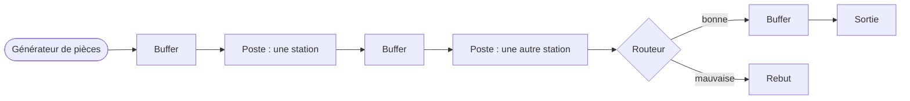
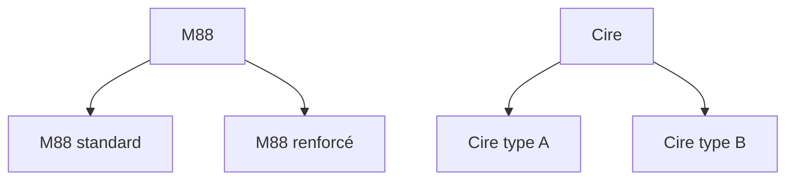
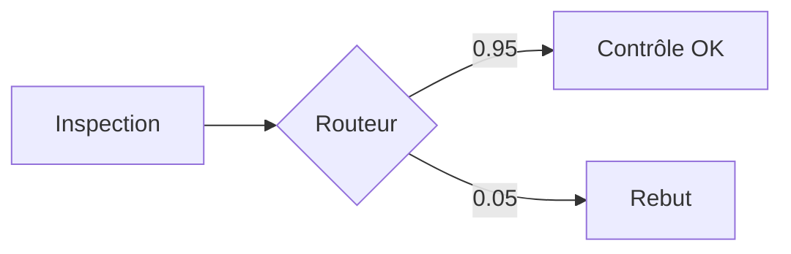
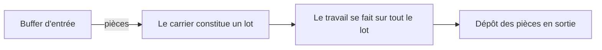
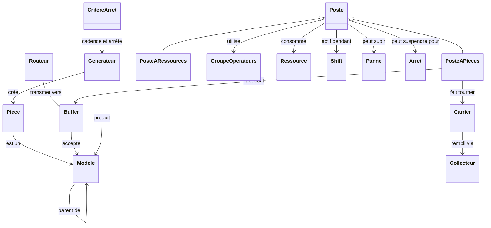
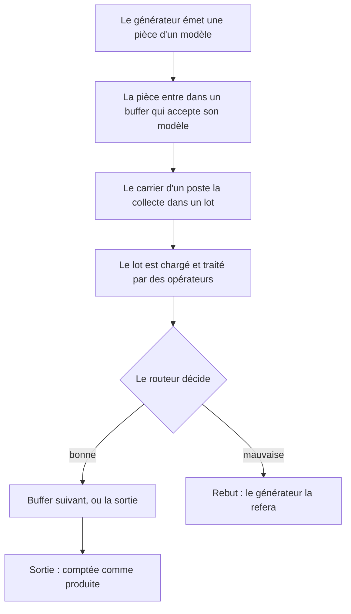

# La simulation, expliquée

Ce document explique comment fonctionne la simulation, en langage clair. Il s'adresse à toute personne qui veut comprendre ce que fait vraiment le modèle : ce qu'est une pièce, ce qu'est un poste, ce que veulent dire tous ces réglages, et pourquoi les résultats sortent comme ils sortent. Vous n'avez pas besoin de lire le code.

Si vous comptez utiliser le Flow Designer, lisez ceci d'abord. Le designer n'est qu'une façon conviviale de construire et lancer ce modèle, et il emploie les mêmes mots pour tout (pièce, poste, buffer, opérateur, et ainsi de suite). Une fois les concepts d'ici assimilés, le [guide du Flow Designer](flow-designer.fr.md) tombera sous le sens.

Un mot sur le vocabulaire : le modèle a été construit pour un atelier réel (injection de cire et fonderie à la cire perdue), donc les exemples s'appuient sur ce monde. Mais rien ici n'est spécifique à la cire. Une « pièce » pourrait être une portière, une carte électronique, ou un gâteau. Si ça traverse des postes et se fait travailler, ce modèle peut le représenter.

---

## 1. La vue d'ensemble

Imaginez une ligne de production. Des pièces brutes apparaissent à un bout, traversent une série de postes où machines et personnes travaillent dessus, et des pièces finies sortent à l'autre bout. Certaines pièces partent au rebut en chemin. C'est tout.

Chaque boîte de cette image est un concept que vous allez rencontrer plus bas. Les flèches sont le chemin que suivent les pièces. Le reste du document parcourt chaque boîte, à peu près dans l'ordre où une pièce les rencontre.

Deux idées tiennent l'ensemble :

- **Tout se passe en temps simulé.** L'horloge interne de la simulation se compte en minutes. Une exécution de deux ans fait environ 1 050 000 minutes. La simulation saute d'événement en événement (une pièce qui arrive, une machine qui finit) au lieu d'égrener les minutes une à une, et c'est pourquoi elle peut simuler deux ans en quelques secondes.
- **Le calendrier est réel.** Vous donnez à la simulation une date de début, et chaque minute se rattache à une vraie date et heure. Donc quand un rapport dit qu'une pièce a fini le « 15-01-2026 14:05 », c'est un vrai moment du calendrier, compté à partir du début.

---

## 2. Pièces et modèles

Une **pièce** est un article physique qui traverse la ligne. Elle naît au générateur, voyage, et finit par sortir ou partir au rebut.

Un **modèle** est le *type* d'une pièce. Voyez-le comme la référence produit. Deux pièces du modèle « M88 » sont interchangeables ; une pièce du modèle « LEAP » est un produit différent qui peut suivre un autre chemin et prendre d'autres temps.

Les modèles peuvent avoir un **parent**, ce qui crée un arbre généalogique. C'est réellement utile. Supposons « M88 standard » et « M88 renforcé » comme deux enfants d'un parent « M88 ». Un poste configuré pour accepter « M88 » accepte les deux enfants automatiquement, parce que le modèle connaît ses ancêtres. Vous configurez le cas général une fois, et les variantes précises en héritent. Un poste peut aussi être configuré pour un seul enfant si celui-ci demande un traitement particulier.

Les modèles sans enfants sont les **modèles feuilles**. Ce sont les seuls qu'un générateur produit réellement, car une vraie pièce est toujours une variante précise, jamais la famille abstraite. Les modèles parents existent pour que vous puissiez parler de groupes.

---

## 3. Où les pièces attendent : buffers et routeurs

Entre les postes, les pièces patientent dans des **outlets** (points de dépôt). Il y a deux sortes d'outlets : les buffers et les routeurs.

### Les buffers

Un **buffer** est une zone d'attente. Les pièces arrivent, font la queue, et attendent que le poste suivant les prenne. Chaque buffer a une liste de **modèles valides** : les types de modèles qu'il a le droit de contenir. Une pièce ne peut entrer que dans un buffer qui accepte son modèle.

Les buffers existent en trois types, et le type décide de ce que le buffer *veut dire* :

| Type de buffer | Ce que c'est | Ce qui arrive aux pièces |
|---|---|---|
| **Passage** | Une zone d'attente normale entre postes | Les pièces attendent, puis un poste aval les prend |
| **Sortie (Exit)** | La ligne d'arrivée | Une pièce ici est finie et comptée comme produite. Il y a exactement un buffer de sortie par modèle. |
| **Rebut (Scrap)** | La benne à rejets | Une pièce ici est jetée. Elle quitte la ligne pour de bon. |

Les buffers de sortie et de rebut sont spéciaux parce que les pièces n'en repartent jamais. Ce sont des états terminaux. Tout le reste est un buffer de passage où les pièces ne font que transiter.

### Les routeurs

Un **routeur** est un embranchement. Quand une pièce entrerait dans un routeur, celui-ci l'envoie aussitôt vers l'un de plusieurs buffers, choisi par probabilité. Il ne retient pas les pièces ; il décide et transmet dans le même instant.

L'usage classique est le contrôle qualité. Après un poste d'inspection, un routeur envoie 95 % des pièces vers le buffer « accepté » et 5 % vers le rebut :

Une branche d'un routeur peut être le **freeloader** (« passager clandestin ») : au lieu d'une probabilité fixe, elle prend « tout ce qui reste ». Si vous mettez une branche à 0,05 et marquez l'autre comme freeloader, celle-ci reçoit 0,95 automatiquement. Ça vous évite de faire tomber la somme à exactement 1 à la main, et ça continue de marcher si vous changez le 0,05 plus tard.

Les probabilités peuvent aussi changer dans le temps (voir la section sur les fonctions du temps), donc vous pouvez modéliser un process qui dérive, par exemple un taux de rebut qui grimpe à mesure que l'outillage s'use.

---

## 4. Les postes : les stations

Un **poste** est une station de la ligne : un endroit où le travail se fait. C'est le concept le plus riche du modèle, donc on va le construire lentement.

Il y a deux sortes de postes, qui diffèrent par *ce qui les traverse* :

- Un **poste à pièces** travaille sur des pièces. Les pièces arrivent depuis des buffers d'entrée, se font travailler, et repartent vers des buffers de sortie. L'injection, le marquage, l'inspection et le stockage sont tous des postes à pièces.
- Un **poste à ressources** travaille sur des matières, pas des pièces. Il consomme de la matière première et produit davantage d'une autre matière. Pensez à un poste qui fait fondre des granulés de cire en cire liquide, ou qui mélange une barbotine céramique. Aucune « pièce » individuelle ne le traverse ; des quantités de matière, oui.

L'essentiel d'une usine, ce sont des postes à pièces. Les postes à ressources sont les seconds rôles qui gardent les consommables au niveau. On se concentre d'abord sur les postes à pièces, puis on couvre ce qui est propre aux postes à ressources.

### Le carrier : l'unité de travail

Voici l'idée la plus importante pour comprendre les postes. Un poste ne travaille pas sur une pièce à la fois, isolée. Il travaille par **lots**, et ce qui porte un lot s'appelle un **carrier**.

Imaginez un plateau, une grille de four, un panier. Le carrier, c'est ce plateau. Il rassemble des pièces, les maintient ensemble pendant que la station travaille tout le groupe d'un coup, puis les dépose. Un carrier naît vide, se remplit de pièces, passe par le travail, et dépose ses pièces à la fin.

Pourquoi des lots et pas des pièces seules ? Parce que les vraies stations fonctionnent ainsi. Un four cuit une grille entière. Un inspecteur peut vérifier les pièces une par une (un lot de un), mais une étape de séchage peut en gérer quarante d'un coup. Le carrier, c'est la façon dont le modèle capture « combien de pièces sont traitées ensemble ».

Un seul poste peut faire tourner **plusieurs carriers en même temps** si vous l'autorisez. Ça modélise une station où plusieurs plateaux peuvent être en cours à la fois, comme une grande zone d'attente où de nombreux groupes de pièces sèchent en parallèle. On y revient avec les réglages de capacité.

### La vie d'un carrier

Un carrier passe par les mêmes étapes à chaque fois. Comprendre ces étapes est la clé pour lire les résultats plus tard, car les rapports mesurent exactement le temps que les carriers passent dans chacune.

1. **Mise en route (startup).** Avant que la station puisse travailler, elle peut devoir chauffer ou se régler. Un four préchauffe ; une machine se calibre. Ça arrive une fois quand la station se réveille, et de nouveau après toute interruption ou au début d'un nouveau shift.
2. **Collecte.** Le carrier rassemble ses pièces depuis les buffers d'entrée. Il attend d'en avoir assez (ou jusqu'à perdre patience, voir le timeout plus bas). C'est là qu'une station affamée perd du temps : pas de pièces à collecter, le carrier attend, point.
3. **Chargement.** Les pièces rassemblées sont chargées sur la station. Ça prend du temps et demande souvent un opérateur.
4. **Traitement.** Le travail réel : cuisson, découpe, injection. Ça prend du temps (qui peut dépendre du modèle) et peut demander un opérateur et de la matière.
5. **Dépôt.** Les pièces finies sont déposées dans les buffers de sortie, et le carrier a terminé.

Si la station est interrompue en plein travail (une panne, un arrêt programmé, ou la fin d'un shift), le carrier peut être abandonné et ses pièces renvoyées en attente, selon les politiques que vous réglez. C'est couvert dans la section sur les interruptions.

### Les collecteurs : comment un carrier décide quoi prendre

Le **collecteur** est la partie du carrier qui fait l'étape 2, la collecte. Il décide quelles pièces prendre et quand cesser d'attendre. C'est là que vit une bonne part de la subtilité du modèle, donc il a sa propre section plus bas (section 6, sur les types de collecteurs). Pour l'instant, gardez juste l'idée : le collecteur, c'est la logique qui remplit le plateau.

---

## 5. Les réglages d'un poste, un par un

Quand vous configurez un poste à pièces, vous fixez un certain nombre de valeurs. Voici ce que veut dire chacune, groupées pour qu'elles se tiennent.

### La taille de lot : combien de pièces par carrier

Ces réglages sont par modèle, parce que différents produits peuvent se lotir différemment.

- **Capacité minimale du carrier.** Le plus petit lot que le carrier accepte avant de commencer à travailler. Si c'est 4, le carrier attend d'avoir au moins 4 pièces (ou de timeouter). Mettez 1 et la station travaille avec ce qu'elle peut avoir, une pièce à la fois s'il n'y a que ça.
- **Capacité maximale du carrier.** Le plus grand lot que le carrier tient. Si c'est 4, le plateau est plein à 4 et ne prend pas de cinquième.

Un four qui cuit des grilles de 4 mettrait les capacités mini et maxi toutes deux à 4 (toujours une grille pleine), ou mini 1 et maxi 4 (commencer avec ce qui est dispo, jusqu'à une grille pleine).

### La capacité : combien de carriers à la fois

- **Capacité max (max capacity).** Le nombre total de places-pièces de la station, à travers tous ses carriers qui tournent en même temps. C'est le réglage qui décide du parallélisme de la station. Si la capacité max est 4 et que chaque carrier tient 4, un seul carrier tourne à la fois. Si la capacité max est 40 et que chaque carrier tient 4, jusqu'à 10 carriers peuvent tourner en parallèle. Une grande zone de stockage ou de séchage utilise une grande capacité max ; une simple machine en série utilise une capacité max égale à un carrier.
- **Carriers minimum (minimum carriers).** Combien de carriers doivent être prêts à se lancer ensemble en « vague ». Généralement 1. Si vous montez ce chiffre, les carriers s'attendent avant qu'aucun ne démarre, ce qui modélise une station qui ne tourne qu'avec un jeu complet de plateaux.

Il y a une règle que le modèle impose : la capacité max doit être au moins aussi grande que ce qu'un carrier réclame, sinon les carriers ne peuvent jamais constituer leur lot et la station se bloque. Le designer le vérifie pour vous.

### Carriers contigus et indépendants

Ces deux interrupteurs changent la façon dont les carriers se partagent la capacité de la station.

- **Carriers contigus.** Ça décide si un carrier réserve d'emblée toute son empreinte maximale, ou seulement la place pour les pièces qu'il tient réellement. Avec les carriers contigus désactivés, un carrier autorisé jusqu'à 4 pièces réserve 4 places même pendant qu'il collecte encore, donc les places réservées-mais-vides ne sont pas dispos pour les autres. Avec l'option activée, le carrier n'occupe que ce qu'il tient à l'instant. Ça compte surtout pour la lecture du graphe « places occupées » et pour la possibilité d'entasser beaucoup de petits carriers dans une station.
- **Carriers indépendants.** Ça décide si les carriers avancent chacun sur sa propre horloge ou en cadence commune. Des carriers indépendants passent chacun par leur propre cycle mise en route, collecte, chargement, traitement quand ils sont prêts. C'est le modèle d'une grande zone d'attente parallèle où chaque plateau fait sa vie. Des carriers non indépendants bougent ensemble, en groupe.

Si ça vous paraît abstrait, ce n'est pas grave. La plupart des postes ordinaires utilisent un carrier à la fois et vous pouvez laisser ces réglages sur leurs valeurs simples par défaut. Les interrupteurs existent pour les stations spéciales : grandes zones de stockage parallèle, zones de séchage, salles d'attente.

### Les durées

Trois temps distincts, chacun configuré comme une loi de probabilité (voir section 10 sur l'aléatoire) pour varier de façon réaliste d'une exécution à l'autre :

- **Durée de mise en route.** Combien de temps prend le préchauffage ou le réglage.
- **Durée de chargement.** Combien de temps prend le chargement d'un lot sur la station.
- **Durée de traitement.** Le temps de travail réel. Celui-ci se règle *par modèle*, car une pièce renforcée peut prendre plus de temps à l'injection qu'une standard.

### Le timeout

Le **timeout** est le temps qu'un carrier attend pendant la collecte avant de renoncer et de travailler avec ce qu'il a réussi à rassembler. Mettez l'infini et le carrier attend éternellement un lot plein. Mettez un nombre fini et le carrier, après ce délai, cesse d'attendre et traite un lot partiel (ou, s'il n'a rien collecté, il continue d'attendre au moins une pièce pour ne jamais traiter un plateau vide).

Ce réglage est subtil et a causé de vraies confusions en pratique, donc voici la version honnête. Le timeout se mesure pendant que le carrier essaie activement de collecter. Une erreur courante est de mettre un timeout plus long qu'un shift : si la station sort de shift chaque soir, la tentative de collecte se réinitialise, et un timeout trop long peut ne jamais se déclencher. Si vous voulez qu'une station évacue des lots partiels, le timeout doit être plus court que la fenêtre de travail où elle vit.

### La priorité

Chaque poste a une **priorité** de 0 à 10, où 10 est le plus important. La priorité décide qui gagne quand deux postes veulent la même ressource rare (une place, une pièce, une matière) au même instant. Un poste plus prioritaire est servi en premier.

Une réserve honnête importante : la priorité régit les demandes de places, de pièces et de matières. Qu'elle régisse la compétition pour les *opérateurs* dépend de la version du moteur que vous lancez, et c'est un domaine qui a évolué. Si vous comptez sur la priorité pour protéger l'accès d'un poste goulot à un groupe d'opérateurs partagé, vérifiez que ça fait bien ce que vous attendez sur votre configuration. La manière la plus sûre de garantir des gens à un poste est de lui donner un groupe d'opérateurs dédié plutôt que d'en partager un.

### Le drapeau Admin

Le drapeau **admin** marque un poste comme administratif plutôt que productif. Les zones d'attente, le stockage, les mises en attente pour contrôle, et les zones de rétention « prison » sont administratives : elles font partie du process mais n'ajoutent pas de valeur comme le fait une étape d'usinage ou d'injection. Ce drapeau ne change rien à la façon dont la simulation tourne. Il ne fait que ranger le poste dans la colonne « administratif » d'un rapport de synthèse, pour répondre à « quelle part de mon temps de process part dans des étapes sans valeur ajoutée ? ». Plus de détails dans le [guide des KPI](kpis.fr.md).

---

## 6. Les types de collecteurs : comment le lot se remplit

Retour au collecteur, la logique qui remplit un carrier. Il y a quatre types, issus de la combinaison de deux choix indépendants. Ça vaut le coup de comprendre, car ça change le débit et l'ordre dans lequel les pièces sont traitées.

**Choix un : greedy ou altruiste.** C'est la question de *quand un carrier se contente de moins qu'un lot plein*.

- Un collecteur **greedy** (glouton), une fois son lot minimum atteint, continue de compléter vers le maximum tant que des pièces sont dispos tout de suite, mais il n'attend pas pour davantage. Il prend ce qu'il peut et il part.
- Un collecteur **altruiste** accepte d'attendre plus longtemps pour assembler un meilleur lot, laissant des pièces un moment plutôt que de tout rafler tout de suite. Il est plus patient.

**Choix deux : discriminant ou non.** C'est la question de *savoir si le carrier se soucie du modèle qu'il collecte*.

- Un collecteur **non discriminant** prend n'importe quelle pièce acceptable, mélangeant les modèles dans un lot. Ça n'a de sens que si tous les modèles qu'il accepte partagent le même temps de traitement et les mêmes tailles de lot, car tout le lot est traité comme un.
- Un collecteur **discriminant** choisit un modèle sur lequel se concentrer et ne collecte que ce modèle pour ce lot, donc le lot est uniforme. C'est ce qu'on utilise quand des modèles différents demandent des traitements différents.

Combinez-les et vous avez les quatre types : non discriminant greedy, discriminant greedy, non discriminant altruiste, discriminant altruiste.

Quand un collecteur discriminant doit choisir *quel* modèle viser, il suit une règle que vous réglez (le choix du « modèle focus ») :

- **Le plus présent :** viser le modèle qui a le plus de pièces en attente à l'instant. C'est le défaut naturel et ça fait avancer la file la plus chargée.
- **La durée de traitement la plus rapide :** viser le modèle qui se traite le plus vite, pour maximiser le débit brut.
- **Le plus petit écart au lot minimum :** viser le modèle le plus proche de pouvoir remplir un lot, pour que les lots se bouclent plus tôt.

Quelle pièce est prise en premier *au sein* du focus est décidé par une autre petite règle : **premier entré premier sorti** (la pièce qui attend depuis le plus longtemps dans le buffer) ou **premier créé premier sorti** (la plus vieille pièce par naissance, peu importe le buffer où elle a séjourné). Premier entré premier sorti est le choix habituel et colle au comportement d'une vraie file.

---

## 7. Les opérateurs : les personnes

Le travail demande des gens. Un **groupe d'opérateurs** est une équipe : un nombre de personnes interchangeables qui partagent un planning.

- Le groupe a une **taille** (combien de personnes) et un ensemble de **shifts** (quand ils sont au travail). Hors de leurs shifts, le groupe est simplement indisponible, et tout poste qui compte sur eux cale jusqu'à leur retour.
- Le groupe a une **productivité**, qui met à l'échelle leur vitesse de travail. Une productivité de 1,0 est nominale. Au-dessus de 1 ils travaillent plus vite que le standard, en dessous plus lentement. Comme les durées, la productivité peut être une loi, pour que le rythme d'un opérateur varie.

Un poste ne pointe pas directement vers un groupe d'opérateurs. Il pointe vers des **alternatives** : une liste de groupes acceptables, essayés dans l'ordre. « Prendre l'équipe A, ou si elle est indisponible, l'équipe B. » La première alternative qui a assez de gens libres décroche le travail. C'est ainsi qu'on modélise le personnel polyvalent et les remplacements. Tous les opérateurs d'une même alternative doivent avoir la même productivité, puisque le modèle les traite comme équivalents pour ce travail.

Un poste peut réclamer des opérateurs à trois moments, chacun avec ses propres alternatives : les **opérateurs de mise en route** (pour régler la machine), les **opérateurs de chargement** (pour charger un lot), et les **opérateurs de traitement** (pour mener le travail). Souvent c'est le même groupe, mais ce n'est pas obligé.

### Le scope opérateur : combien de temps on garde les gens

C'est le réglage qui fait trébucher, donc le voici soigneusement. Le **scope opérateur** décide combien de temps un poste garde ses gens.

- **Par lot (per batch).** Les opérateurs sont demandés quand un lot précis en a besoin (pour le charger, pour le traiter) et relâchés dès que ce lot en a fini avec eux. Les gens flottent entre postes, attrapés pour un travail puis lâchés. C'est le modèle souple et partagé.
- **Par tâche (per task).** Le poste réquisitionne une équipe et la garde tant qu'il tourne, à travers de nombreux lots, ne la relâchant que quand il se calme ou sort de shift. L'équipe est « postée » à cette station. Ça modélise un opérateur dédié qui reste à sa machine tout le shift, qu'une pièce soit sous ses mains ou non.

La différence saute aux yeux dans les rapports de main-d'œuvre. Une équipe par tâche est comptée occupée pendant tout son affectation, y compris les creux entre lots, parce qu'un vrai posté est occupé rien qu'à être là, même inactif un instant. Une équipe par lot n'est comptée que pour les travaux réels.

(Le scope opérateur ne peut pas être « par unité », et le scope ressource ne peut pas être « par tâche » ; le modèle rejette ces combinaisons parce qu'elles ne correspondent à rien de sensé.)

---

## 8. Les ressources : les matières

Une **ressource** est une matière consommable ou un équipement réutilisable : cire liquide, barbotine, un moule, une plaque de fixation. Les postes peuvent réclamer des ressources pour travailler.

Les ressources ont quelques propriétés :

- Une **capacité** et une **quantité initiale** : combien on peut tenir et avec combien on commence.
- Une **durée de vie** : combien de temps une unité reste utilisable avant de périmer. Une durée de vie infinie veut dire qu'elle ne s'abîme jamais. Une durée de vie finie modélise une matière périssable qu'il faut utiliser à temps.

Une **ressource réapprovisionnable** se recommande toute seule. Quand le stock tombe sous un **seuil**, elle passe une commande. La commande prend une **durée de commande** pour être prise en compte et une **durée de livraison** pour arriver, puis le stock est remis à niveau de la capacité. Ça modélise l'appro avec délai : vous arrivez à court, vous commandez, et il y a une attente avant que le camion se pointe. Si un poste a besoin d'une matière épuisée, il attend (les rapports appellent ça « attente matière »), et cette attente inclut le délai de recommande.

---

## 9. Les postes à ressources : transformer les matières

Un **poste à ressources** est la sorte de station qui travaille sur des matières au lieu de pièces. Il prend des ressources en entrée et produit des ressources en sortie. Un poste de fusion consomme des granulés de cire et produit de la cire liquide ; un poste de mélange consomme poudre sèche et eau et produit de la barbotine.

Les réglages distinctifs d'un poste à ressources :

- **Ressources non transformées :** des matières qu'il a besoin d'avoir présentes pour tourner mais qu'il ne consomme pas comme entrée principale (un moule qui doit être là, mais qui n'est pas épuisé).
- **Ressources transformées :** les matières qu'il consomme réellement, chacune avec une **proportion** disant quelle part du mélange elle représente. Les proportions marchent comme une recette et totalisent le mélange complet.
- **Récupérable (salvageable) :** si la matière transformée en trop peut être récupérée quand le lot ne l'utilise pas toute, plutôt que gaspillée.
- **Ressources de sortie :** ce qu'il produit, avec une loi pour la quantité qui sort et des bornes sur la plage.

Tout le reste (opérateurs, durées, shifts, pannes) marche comme un poste à pièces. Un poste à ressources utilise un collecteur plus simple avec juste le choix greedy ou altruiste, puisqu'il n'y a pas de « modèles » à discriminer, seulement des quantités.

---

## 10. Aléatoire, fonctions du temps, et lois de probabilité

Les vraies usines ne sont pas déterministes, donc la plupart des nombres du modèle peuvent être des **lois de probabilité** plutôt que des valeurs fixes. Une loi est une recette pour tirer un nombre aléatoire chaque fois qu'il en faut un. Celles disponibles :

| Loi | Forme | Usage typique |
|---|---|---|
| **Constant** | Toujours la même valeur | Un temps fixe et exact |
| **Uniform** | N'importe quelle valeur entre un bas et un haut, également probables | « Quelque part entre 8 et 12 minutes » |
| **Normal** | Courbe en cloche autour d'une moyenne | Variation naturelle autour d'un temps typique |
| **Exponential** | Beaucoup de courts, peu de longs | Temps entre événements aléatoires |
| **Triangular** | Un bas, un plus probable, un haut | Une estimation avec un meilleur pari |
| **LogNormal** | Asymétrique, jamais négative | Des durées qui filent parfois très long |

En plus, certaines valeurs peuvent être des **fonctions du temps** : elles changent au fil de l'exécution. Une probabilité de branche, une productivité d'opérateur, ou un taux de génération peut suivre une droite, une courbe exponentielle, ou un changement par palier. Ça permet de modéliser la dérive et les changements planifiés, comme un taux de rebut qui monte à mesure qu'un outil s'use, ou une montée en cadence le premier mois.

Comme tout est aléatoire, la simulation utilise une **graine (seed)** : un nombre de départ pour l'aléatoire. La même graine avec le même modèle donne exactement la même exécution, à chaque fois. Changez la graine et vous avez une exécution différente mais tout aussi valable. C'est ainsi qu'on peut soit reproduire un résultat à l'identique, soit explorer l'éventail des issues.

---

## 11. Les shifts et le calendrier

Un **shift** est un planning de travail : les heures où une station, un générateur, ou un groupe d'opérateurs est actif. Hors de ses shifts, une entité est fermée et ne fait rien.

Les shifts se définissent de deux façons :

- **Hebdomadaire (weekly) :** un motif hebdomadaire qui se répète (lundi 6h à 14h, etc.), appliqué sur une plage de dates.
- **Personnalisé (custom) :** des dates-heures de début et fin explicites, pour les plannings irréguliers.

Les deux sortes peuvent porter des **jours fériés / de fermeture (days off)** : des dates précises du calendrier (fériés, fermetures planifiées) où le planning ne s'applique pas, tirées d'une liste partagée de jours de fermeture.

Les shifts sont le lien du modèle avec le vrai calendrier, et ils expliquent beaucoup de résultats. Une station qui paraît lente est peut-être simplement fermée la moitié du temps. Un opérateur jamais dispo au bon moment est peut-être juste sur un autre shift. Quand la production cale, les shifts sont d'habitude la première chose à vérifier.

---

## 12. Les interruptions : pannes et arrêts

Les stations ne tournent pas proprement pour toujours. Deux choses les interrompent.

### Les pannes (breakdowns)

Une **panne** est une défaillance aléatoire et non planifiée. Elle se définit par deux nombres :

- **Temps moyen entre pannes (MTBF) :** combien de temps la station tourne typiquement avant de tomber en panne.
- **Temps moyen de réparation (MTTR) :** combien de temps prend typiquement une réparation.

Quand une station tombe en panne, son travail en cours est interrompu. Pour un poste à pièces, les pièces en cours ne sont pas perdues : elles sont déposées dans des outlets « canot de sauvetage » que vous configurez, pour aller quelque part de sûr plutôt que de disparaître. Une fois réparée, la station reprend. Les pannes sont une source majeure de perte de disponibilité, et les rapports suivent combien de temps et combien de défaillances chaque station a connues.

### Les arrêts programmés (shutdowns)

Un **arrêt programmé** est un arrêt planifié : maintenance, nettoyage, changement de série prévu. Contrairement à une panne, il est au calendrier. Il y a deux variantes, et la différence porte sur ce qui arrive au travail en cours :

- **Arrêt non flexible.** Il a lieu exactement quand prévu, un point c'est tout. Le travail en cours est interrompu.
- **Arrêt flexible.** Il peut glisser un peu pour laisser le lot en cours finir, plutôt que de le couper en plein travail. L'arrêt a quand même lieu, juste à un moment un peu plus commode.

Les arrêts peuvent être listés explicitement (dates-heures précises) ou générés périodiquement (tous les tant de temps, pour une durée fixe, sur une plage de dates).

La distinction entre panne et arrêt compte pour les rapports : un arrêt est une perte *planifiée* (elle sort du « temps requis » avant même que la disponibilité soit mesurée), tandis qu'une panne est une perte *non planifiée* (elle compte contre la disponibilité). C'est de la comptabilité d'atelier standard, et le [guide des KPI](kpis.fr.md) explique où chacune atterrit.

---

## 13. Le générateur : d'où viennent les pièces

Chaque modèle a exactement un **générateur de pièces** : la source qui injecte de nouvelles pièces dans la ligne. Il émet des pièces pendant ses propres shifts, vers ses buffers de sortie, à un rythme fixé par le critère d'arrêt (section suivante). Il y a deux modes.

### Le mode objectifs

En **mode objectifs**, vous donnez à chaque modèle un nombre cible de pièces à produire, et le générateur se cadence pour atteindre ces cibles sur son temps de travail disponible. Le rythme entre pièces s'appelle le **gap**. Vous pouvez fixer le gap à la main, ou laisser le générateur le calculer automatiquement à partir de l'objectif total et du temps de travail.

Le mode objectifs a deux caractéristiques à connaître :

- **La période de grâce (grace period).** Quand le gap est automatique, vous pouvez réserver une **période de grâce** : un morceau de temps de travail à la fin que le générateur n'utilise pas pour son rythme de base. Ça donne à la ligne du mou pour se vider et refaire les pièces rebutées avant l'échéance. Voyez-le comme une marge de sécurité, un budget pour les refabrications.
- **La refabrication consciente du rebut.** Le générateur surveille les compteurs de sortie et de rebut. Quand une pièce part au rebut, le générateur sait qu'il doit toujours une bonne pièce sur l'objectif, donc il en refait une. Les objectifs se comptent en *bonnes* pièces livrées, pas en pièces brutes injectées. C'est pourquoi une exécution peut injecter plus de pièces que l'objectif : elle remplace celles qui sont parties au rebut.

L'interaction entre période de grâce et taux de rebut est la partie subtile. La période de grâce est un budget fixe de temps en plus ; chaque refabrication en consomme une part. Si votre taux de rebut est élevé, vous pouvez épuiser la grâce avant que toutes les refabrications soient faites, et l'exécution finit en deçà de l'objectif. Dimensionner la période de grâce face au nombre attendu de rebuts est la clé pour atteindre une cible de façon fiable.

### Le mode débit

En **mode débit**, il n'y a pas d'objectif par modèle. Le générateur émet simplement des pièces à un **rythme** (un gap entre pièces, éventuellement changeant dans le temps), avec un **mélange** disant quelle fraction des pièces est chaque modèle. Un modèle peut être le freeloader, prenant la fraction qui reste. Ce mode sert à étudier une ligne sous un flux d'entrée donné plutôt qu'à courir après une cible de production.

---

## 14. Arrêter la simulation

Une exécution doit finir d'une manière ou d'une autre. Le **critère d'arrêt** décide quand, et il vient en deux formes qui s'apparient naturellement avec les deux modes du générateur.

- **Par le temps (by time).** L'exécution finit à une date choisie. On l'utilise avec le mode débit : émettre des pièces à un certain rythme et voir où en est la ligne après, disons, un an.
- **Par pièces produites (by pieces produced).** L'exécution finit quand le buffer de sortie a collecté l'objectif total de bonnes pièces. On l'utilise avec le mode objectifs : produire 30 000 pièces et s'arrêter. Ce critère a aussi un **timeout** : une limite de sécurité pour que, si l'objectif est d'une façon ou d'une autre inatteignable, l'exécution finisse quand même au lieu de tourner sans fin. Si le timeout se déclenche avant l'objectif, l'exécution s'arrête et le rapport montre jusqu'où elle est allée.

Il y a aussi un garde-fou discret : si une exécution est réglée pour ne jamais timeouter et pourtant aucune pièce n'atteint la sortie pendant une très longue tranche de temps simulé, la simulation s'arrête elle-même avec un message clair, plutôt que de tourner sans fin sur un modèle qui ne peut plus progresser.

---

## 15. Tout assembler : le tableau des classes

Voici comment les concepts se relient, en référence. Vous les avez tous rencontrés à présent.

Et le parcours d'une seule pièce dans sa vie :

---

## Où aller ensuite

- Pour construire et lancer votre propre modèle, lisez le [guide du Flow Designer](flow-designer.fr.md). Il suppose que vous comprenez les concepts d'ici.
- Pour lire les chiffres qu'une exécution produit, lisez le [guide des KPI](kpis.fr.md).

Si un résultat vous surprend, les suspects habituels, dans l'ordre, sont : les shifts (quelque chose était fermé), les opérateurs (personne n'était dispo), les tailles de buffers (un goulot affamait l'aval), et la période de grâce (pas assez de budget pour refaire les rebuts). Presque tous les « pourquoi c'est arrivé » remontent à l'un de ces quatre.
