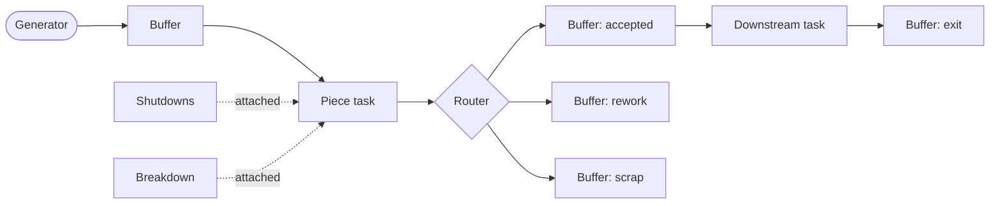

# Flow Designer User Guide

The Flow Designer is the graphical application used to build simulation models, run them, and explore the results. This guide covers the complete feature set.

**Prerequisite:** the [simulation reference](simulation.en.md). This guide uses its concepts (piece, model, task, carrier, buffer, operator, shift) without redefining them.

---

## 1. Working principle

A model is built as a diagram. Each station, buffer, and source is a **card** on a canvas; **wires** between cards define how pieces flow. Card settings are edited through a dialog opened by double-clicking the card. Definitions shared across the model (product models, operator groups, schedules) are managed in **registries** rather than on individual cards. Once the model is complete, it is validated, run, and the results are examined directly on the diagram.

The workflow is: build, configure, run, analyze.

---

## 2. Canvas navigation

- **Pan:** drag the canvas background with the mouse-wheel button, or hold Alt and drag an empty area.
- **Zoom:** mouse wheel.
- **Select:** click a card; drag a rectangle, or Shift-click for multiple selection.
- **Move:** drag selected cards. Card placement is purely visual; only the wiring affects the simulation.
- **Frame all** (Tools menu): fits the entire model in the view.

Card configuration is done through the settings dialogs described in section 6.

---

## 3. Creating cards

The **Create** menu inserts a new card at the center of the current view. Each entry corresponds to a simulation concept:

| Menu entry | Component |
|---|---|
| Piece generator | The configurable source of pieces. |
| Buffer | A queue: passage between two tasks, exit, or scrap. |
| Router | A probabilistic fork, typically for quality sorting. |
| Piece task | A station processing pieces. |
| Resource task | A station transforming materials. |
| Shutdowns | A planned stop, attached to a task. |
| Breakdown | A random failure, attached to a task. |

New cards carry default settings. Rename and configure a card through its settings dialog (section 6).

---

## 4. Wiring

Cards expose **ports** on their edges. Drag from an output port to an input port to create a wire. Wires define the flow of pieces and the attachment of interruptions.

The designer enforces connection validity: only meaningful combinations can be wired. Invalid connections are rejected at drawing time.

Typical connections:

- Generator to buffer(s): where new pieces arrive.
- Buffer(s) to task: a station's input.
- Task to buffer(s) or router(s): a station's output.
- Router to buffers: the branches of the fork.
- Shutdowns to task and breakdown to task: attachment of interruptions.

Two buffers never connect directly; a task always sits between them. A router may feed more than two buffers.

To remove a wire, grab its head (the arrow end) and release it in empty space: the wire disappears. Wires cannot be selected.

---

## 5. Registries

Shared definitions are managed in the **Registries** menu. Cards reference registry entries by name, so registries are typically populated before the cards that use them.

### Models

**Registries, Edit models.** The product models and their hierarchy. Each entry has a name and an optional parent. All model selectors in card dialogs draw from this registry.

> **Note.** A parent must be declared before its children. In a child's Parent field, enter the parent's name verbatim; that name establishes the link.

### Resources

**Registries, Edit resources.** Materials: capacity, initial amount, lifespan, and for restockable resources the threshold, order duration, and delivery duration.

> **Note.** The Flow Designer imposes no units. Every quantity of a resource (registry capacity and initial amount, quantities requested by tasks, quantities produced) is a plain number, interpreted in the unit chosen by the user. Consistency is the user's responsibility: for a given resource, use the same unit everywhere. Report values are expressed in that same unit. Recording the chosen units is recommended.

### Operators

**Registries, Edit operators.** Teams: headcount, shifts (selected from the shift registry), and productivity.

### Shifts

**Registries, Edit shifts.** Schedules, in weekly or custom mode, with optional days off drawn from the closing-days registry.

The shift editor provides two productivity features:

- **Translate:** create a new shift as a time-shifted copy of an existing one.
- **Repeat:** duplicate a shift forward a specified number of times with a calendar translation (years, months, weeks, days). A yearly pattern is defined once and repeated across the horizon; leap years are handled, and each copy carries its days off shifted to the corresponding period.

> **Note.** There is therefore no need to create days off for the later years of a repeated shift. Defining the holidays of a single year (for example 2026) is enough: the repetition derives the holidays of the following years automatically, shifted to the corresponding period.

#### Shifts that cross midnight

A weekly shift whose hours spill into the next day, for example Monday 22:00 to Tuesday 06:00, is created in one of two ways depending on the behavior wanted at holidays. The end hour may exceed 24: `30:00` means 06:00 the next morning.

| Method (weekly mode) | Entry | Behavior when the next day is a holiday |
|---|---|---|
| Single interval | Monday `22:00 -> 30:00` | The Monday night stays **whole** (through Tuesday 06:00). A Tuesday holiday removes only the Tuesday night. |
| Split at midnight | Monday `22:00 -> 24:00` **and** Tuesday `00:00 -> 06:00` | The Monday night is **cut at midnight** (the Tuesday piece, placed on the holiday, is removed). |

Use the single interval when the crew should finish its night despite a holiday the next day; use the split at midnight when no activity should occur on the holiday.

### Closing days

**Registries, Edit closing days.** A shared list of closure dates (public holidays, plant closures). Shifts select their days off from this list, so each date is defined once.

---

## 6. Card configuration

Double-click a card to open its settings dialog. The settings correspond directly to the simulation reference; this section lists what each dialog contains.

### Piece generator

- **Shifts:** the emission schedule.
- Output wiring determines the destination buffers.

The emitted models and their goals or rates are not configured on the card; they are part of **Simulation, Settings** (section 7), because they are tied to the stopping criterion. The generator card defines when and where pieces are emitted; the simulation settings define what and how many.

### Buffer

- **Buffer type:** passage, exit, or scrap.
- **Valid models.**

### Router

- **Branch probabilities**, one per outgoing buffer; optionally one freeloader branch. Values may be constants or time functions.

### Piece task

- **Model configs:** per handled model, the processing duration, the batch sizes (minimum and maximum carrier capacity), and consumed resources.
- **Task durations:** startup and loading.
- **Operators:** alternatives for startup, loading, and processing; operator scope.
- **Carrier settings:** max capacity, minimum carriers, contiguous, independent.
- **Collector type** and the focus-model rule. The focus-model rule has an effect only when the collector is discriminating.
- **Timeout, priority, admin flag.**
- **Protocols:** the protocol selections (shift constraints, pending-carrier handling before stops, operator self-consciousness, piece exit order). Defaults are appropriate for most stations. In the dialog this tab is labeled **Protocols**.
- **Task shifts:** the station's operating schedule, that is, its opening time.

For a first pass, the model configs, the operators, and the task shifts are usually the only settings that require attention.

### Resource task

- **Non-transformed resources**, **transformed resources** (with proportions and salvageable flags), **output resources** (bounded distributions).
- **Duration** and the greedy or altruistic collector choice.
- Operators, carrier settings, timeout, priority, and shifts as for piece tasks.

### Shutdowns

- **Type:** flexible or non-flexible.
- **Schedule:** explicit intervals, or periodic generation (interval, duration, date range).
- Wire the card to the affected task.

### Breakdown

- **MTBF** and **MTTR**, each a distribution.
- For a breakdown on a piece task, wire its outputs to the **lifeboat buffers** that receive in-progress pieces on failure. Breakdowns on resource tasks have no outputs.
- Wire the card to the affected task.

---

## 7. Simulation settings

**Simulation, Settings** holds the run-level configuration:

- **Start date:** the calendar anchor.
- **Seed:** the random seed. A given seed and model reproduce the same run exactly on a given engine.

  > **Note.** The same seed does not produce the same result on the two engines. The random-number generators of Python and C++ differ; the two engines' results are statistically comparable but not identical.

- **Stopping criterion**, which also defines the generator's emission:
  - **By pieces produced (goal mode):** a target per leaf model, a manual gap or a grace period for the automatic gap, and a timeout.
  - **By time (rate mode):** a probability per model (one may be the freeloader), a gap, and the end date.

---

## 8. Disabling cards

Selected cards can be disabled through **Edit, Disable / enable cards** (also available in the context menu). A disabled card remains on the canvas, greyed out, with its wiring intact, but is entirely excluded from validation and from the run: the card, its connections, and all references to it are removed before the simulation is built.

Disabling supports partial testing of a flow (isolating a section of the line) and temporarily parking unfinished stations without deleting them. Re-enabling restores the cards unchanged.

---

## 9. File management

- **File, New:** empty model. Unsaved changes prompt for confirmation.
- **File, Open:** load a model file, replacing the current session.
- **File, Save / Save as:** write the model. The title bar indicates unsaved changes.

A model file is self-contained: it includes the cards, the wiring, the registries, and the simulation settings. Sharing a model means sharing one file.

---

## 10. Validation

**Tools, Validate graph** analyzes the model without running it and reports issues: tasks without inputs or outputs, dead-end buffers, missing operator or shift references, inconsistent probabilities, capacity constraints that would deadlock, missing exit buffer, and criterion misconfiguration.

Validation also runs automatically before every run, with the option to proceed despite warnings. Disabled cards are excluded from validation.

---

## 11. Running a simulation

**Simulation, Run simulation** (F5):

1. The model is saved (the run executes the file on disk).
2. Validation runs; warnings are presented before starting.
3. The progress window opens and the run begins.

### Engine selection

**Simulation, Engine** selects the execution engine:

- **Python:** the reference engine.
- **C++ (native):** a substantially faster engine. A prebuilt binary is bundled per platform; a custom executable can be designated through **Select C++ executable**.

Both engines produce the same output files with the same structure.

> **Note.** At an equal seed, the two engines do not produce identical values: their random generators differ. The results remain statistically comparable. Engine choice affects execution speed and, marginally, the random realization obtained.

### Progress window

During the run, the window displays the current simulated date, the exit count, the progress toward the goal or end date, and the elapsed wall-clock time. When the simulation completes, the window enters a **Generating outputs** phase (indeterminate progress bar) while reports, tables, and charts are written; on large runs this phase takes several seconds.

On completion, the window shows the outcome (goal reached, end date reached, timeout), the report folder path, and the **Open report folder** and **View results** actions.

---

## 12. Results mode

**View results** after a run, or **Results, Open run results** for a previous run, switches the designer to results mode:

- The canvas is locked against editing: neither cards nor wiring can be changed.
- Double-clicking a card opens its metrics: production and waits for a task, queue statistics for a buffer, occupation for an operator group. Double-clicking the **Piece generator** card opens the line metrics: overall flow, production per model (goal, generated, exits, scrap, attainment), and trajectories.
- A bottom panel presents the run-wide tables.
- A heat-map control colors the cards by a selected metric, providing an immediate overview of load distribution and bottlenecks.
- **Exit results mode** returns to editing.

The diagram shown is the exact model that ran; metrics are displayed on the components they describe.

---

## 13. Run outputs

Each run writes a folder under `runs/`, named by date and model file name, containing:

- Per-station, per-buffer, per-operator-group, and per-resource CSV reports.
- Line-wide totals: production, scrap, lead times, work in progress.
- A `graphes/` folder of charts, each provided as a PNG and as the underlying CSV data.
- A copy of the executed model and a run identity file (source, dates, seed, compute time, stopping criterion), making every run reproducible and self-contained.

All CSV files open directly in Excel. The complete description of every file, every metric, and the measurement conventions is in the **[KPI reference](kpis.en.md)**.
