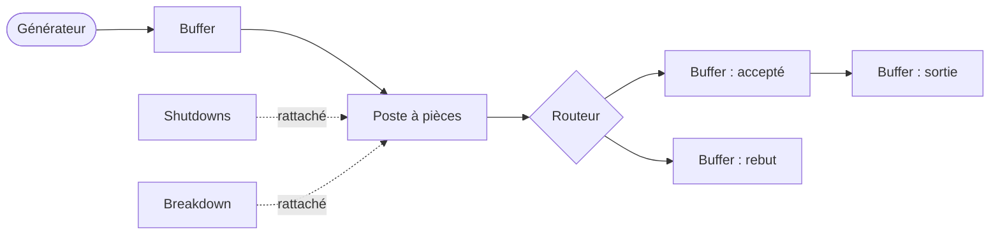

# Guide d'utilisation du Flow Designer

Le Flow Designer est l'application graphique servant à construire les modèles de simulation, à les exécuter, et à en explorer les résultats. Ce guide couvre l'ensemble des fonctionnalités.

**Prérequis :** la [référence de la simulation](simulation.fr.md). Ce guide emploie ses concepts (pièce, modèle, poste, carrier, buffer, opérateur, shift) sans les redéfinir.

---

## 1. Principe de fonctionnement

Un modèle se construit sous forme de diagramme. Chaque station, buffer et source est une **carte** sur un canevas ; des **fils** entre les cartes définissent la circulation des pièces. Les réglages d'une carte s'éditent dans une boîte de dialogue ouverte par double-clic. Les définitions partagées par tout le modèle (modèles produits, groupes d'opérateurs, plannings) sont gérées dans des **registres** plutôt que sur les cartes individuelles. Une fois le modèle complet, il est validé, exécuté, et les résultats s'examinent directement sur le diagramme.

Le flux de travail est : construire, configurer, exécuter, analyser.

---

## 2. Navigation sur le canevas

- **Déplacement :** glisser le fond du canevas (NON EN FAIT. ON GLISEE AVEC LA MOLETTE OU BIEN EN APPUYANT SUR ALT + GLISSER SUR FOND VIDE).
- **Zoom :** molette de la souris.
- **Sélection :** cliquer une carte ; tracer un rectangle ou utiliser le clic avec modificateur pour une sélection multiple (C'EST SHIFT CLICK POUR SELECTION MULTIPLE).
- **Déplacement de cartes :** glisser la sélection. Le placement des cartes est purement visuel ; seul le câblage affecte la simulation.
- **Frame all** (menu Tools) : ajuste la vue à l'ensemble du modèle.

Un panneau **Properties** affichant les champs bruts d'une carte est disponible depuis le menu Tools. Il est masqué par défaut ; la configuration des cartes s'effectue normalement par les boîtes de réglages décrites en section 6 (PEUT ETRE ENLEVER CETTE PHRASE CAR 'PROPERTIES' EST INUTILE. AUSSI ENLEVER LE PANNEAU DU FLOW DESIGNER LUI MEME).

---

## 3. Création de cartes

Le menu **Create** insère une nouvelle carte au centre de la vue courante. Chaque entrée correspond à un concept de la simulation :

| Entrée de menu | Composant |
|---|---|
| Piece generator | La source modulable de pièces. |
| Buffer | Une file : passage entre deux tâches, sortie, ou rebut. |
| Router | Un embranchement probabiliste, typiquement pour le tri qualité. |
| Piece task | Une station traitant des pièces. |
| Resource task | Une station transformant des matières. |
| Shutdowns | Un arrêt planifié, rattaché à un poste. |
| Breakdown | Une panne aléatoire, rattachée à un poste. |

Une carte neuve porte des réglages par défaut. Le renommage et la configuration s'effectuent par sa boîte de réglages (section 6).

---

## 4. Le câblage

Les cartes exposent des **ports** sur leurs bords. Glisser d'un port de sortie vers un port d'entrée crée un fil. Les fils définissent la circulation des pièces et le rattachement des interruptions.

Le designer impose la validité des connexions : seules les combinaisons cohérentes peuvent être câblées. Les connexions invalides sont rejetées dès le tracé.

Connexions typiques :

- Générateur vers buffer(s) : où arrivent les nouvelles pièces.
- Buffer(s) vers poste : l'entrée d'une station.
- Poste vers buffer(s) ou routeur(s) : la sortie d'une station.
- Routeur vers buffers : les branches de l'embranchement.
- Shutdowns vers poste et breakdown vers poste : rattachement des interruptions.

(ICI DANS LA MERMAID CHART, ON RELIE DEUX BUFFER DE SUITE CE QUI N'EST PAS POSSIBLE. AJOUTE UNE TACHE ENTRE EUX. ET PEUT-ETRE AJOUT PLUS QUE DEUX BUFFERS A UN ROUTER POUR MONTRER QUE C'EST POSSIBLE D'EN AVOIR PLUSIEURS)

Pour retirer un fil, le sélectionner et le supprimer. (EN FAIT SUPPRIMER UN FIL CA NE MARCHE PAS COMME CA. IL FAUT TENIR LA FLECHE ET REPLACER SA TETE DANS LE VIDE POUR QU'ELLE DISPARAISSE. ON NE PEUT PAS SELECTIONNER DES FLECHES)

---

## 5. Les registres

Les définitions partagées se gèrent dans le menu **Registries**. Les cartes référencent les entrées de registre par leur nom ; les registres se remplissent donc généralement avant les cartes qui les utilisent.

### Les modèles

**Registries, Edit models.** Les modèles produits et leur hiérarchie. Chaque entrée a un nom et un parent optionnel. Tous les sélecteurs de modèles des boîtes de cartes puisent dans ce registre. (AJOUTE QUE LES PARENTS DOIVENT ETRE DECLARES AVANT LES FILS, ET DANS LA CASE 'PARENT' POUR UN FILS, IL FAUT METTRE LE NOM DU PARENT VERBATIM)

### Les ressources

**Registries, Edit resources.** Les matières : capacité, quantité initiale, durée de vie, et pour les ressources réapprovisionnables le seuil, la durée de commande et la durée de livraison. (AJOUTE ATTENTION QU'IL EST POSSIBLE QUE CHAQUE RESSOURCE AIT UNE UNITE: LES UNITES DANS LE FLOW DESIGNER N'EXISTE PAS DONC C'EST A L'UTILISATEUR DE CHOISIR LES UNITES QU'IL VEUT ET DE S'ASSURER QUE POUR UNE RESSOURCE, UTILISER LES MEMES UNITES PARTOUT : DANS LES REGISTRES, LES QUANTITES DEMANDEES PAR LES TACHES, ETC... ET DONC LE NOMBRE DANS LES OUTPUTS C'EST DANS L'UNITE QUE L'UTILISATEUR A CHOISI. DONC CONSEILLE DE LAISSER UNE NOTE DES UNITES QU'ILS UTILISENT).

### Les opérateurs

**Registries, Edit operators.** Les équipes : effectif, shifts (sélectionnés dans le registre des shifts), et productivité.

### Les shifts

**Registries, Edit shifts.** Les plannings, en mode hebdomadaire ou personnalisé, avec des jours de fermeture optionnels tirés du registre des jours de fermeture.

L'éditeur de shifts fournit deux fonctions de productivité :

- **Translation :** créer un nouveau shift comme copie décalée dans le temps d'un shift existant.
- **Répétition :** dupliquer un shift vers l'avant un nombre spécifié de fois avec une translation calendaire (années, mois, semaines, jours). Un motif annuel se définit une fois et se répète sur l'horizon ; les années bissextiles sont gérées, et chaque copie porte ses jours de fermeture décalés à la période correspondante. (DONC FAUT PAS SE SOUCIER DE CREER DES JOUR FERIES POUR DES DATES ULTERIEURES POUR DES SHIFTS REPETITIFS. PAR EXEMPLE SI JE DEFINIT MES SHIFT SUR 2026, IL SUFFIT DE METTRE LES JOUR FERIES SUR 2026 ET EN REPETANT, LES JOURS FERIES POUR LES ANNEES SUIVANT SONT AUTOMATIQUEMENT DEDUITS)

(EXPLIQUE QUE SI PAR EXEMPLE ON A UN SHIFT HEBDOMADAIRE DE LUNDI 22H A MARDI 6H, ON PEUT LE CREER DE 2 FACONS SELON LE COMPORTEMENT QU'ON VEUT: SOIT DANS LE SHIFT EDITOR WEEKLY MODE ON MET LUNDI 22H -> 24H ET MARDI MINUIT -> 6H SI ON VEUT QUE LES JOUR FERIES FONT EN SORTE QUE CETTE SHIFT DEVIENT JUSTE 22H -> 24H SI ON A UN JOUR FERIE, OU BIEN ON MET JUSTE LUNDI 22H -> 30H (EQUIVAUT A MARDI 6H) SI ON VEUT QUE LA SHIFT CONTINUE DANS LES JOURS FERIES. PEUT ETRE DONNE UN EXEMPLE AVEC UN TABLEAU AVEC DIFFERENT CAS ET LEURS COMPORTEMENTS)

### Les jours de fermeture

**Registries, Edit closing days.** Une liste partagée de dates de fermeture (fériés, fermetures d'usine). Les shifts sélectionnent leurs jours de fermeture dans cette liste ; chaque date est ainsi définie une seule fois.

---

## 6. Configuration des cartes

Double-cliquer une carte ouvre sa boîte de réglages. Les réglages correspondent directement à la référence de la simulation ; cette section liste le contenu de chaque boîte.

### Piece generator (générateur)

- **Shifts :** le planning d'émission.
- Le câblage de sortie détermine les buffers de destination.

Les modèles émis et leurs objectifs ou débits ne se configurent pas sur la carte ; ils font partie de **Simulation, Settings** (section 7), car ils sont liés au critère d'arrêt. La carte générateur définit quand et où les pièces sont émises ; les réglages de simulation définissent quoi et en quelle quantité.

### Buffer

- **Type de buffer :** passage, sortie, ou rebut.
- **Modèles valides.**

### Router (routeur)

- **Probabilités de branche**, une par buffer sortant ; optionnellement une branche freeloader. Les valeurs peuvent être des constantes ou des fonctions du temps.

### Piece task (poste à pièces)

- **Configs de modèles :** par modèle géré, la durée de traitement, les tailles de lot (capacités minimale et maximale du carrier), et les ressources consommées.
- **Durées du poste :** mise en route et chargement.
- **Opérateurs :** alternatives pour la mise en route, le chargement et le traitement ; scope opérateur.
- **Réglages de carriers :** capacité max, carriers minimum, contigus, indépendants.
- **Type de collecteur** et règle de modèle focus (LE MODELE FOCUS N'A DE SENS QUE SI LE COLLECTEUR EST DISCRIMINANT).
- **Timeout, priorité, drapeau admin.**
- **Politiques (RENOMMER 'PROTOCOLES') :** les sélections de protocoles (contraintes de shift, traitement des carriers en attente avant un arrêt, conscience de soi des opérateurs, ordre de sortie des pièces). Les valeurs par défaut conviennent à la plupart des stations.
- **Shifts du poste :** le planning d'exploitation de la station (AKA TEMPS OUVERTURE).

Pour une première passe, les configs de modèles, les opérateurs et les shifts du poste sont généralement les seuls réglages qui demandent attention.

### Resource task (poste à ressources)

- **Ressources non transformées**, **ressources transformées** (avec proportions et drapeaux récupérables), **ressources de sortie** (lois bornées).
- **Durée** et le choix de collecteur greedy ou altruiste.
- Opérateurs, réglages de carriers, timeout, priorité et shifts comme pour les postes à pièces.

### Shutdowns (arrêt programmé)

- **Type :** flexible ou non flexible.
- **Planning :** intervalles explicites, ou génération périodique (intervalle, durée, plage de dates).
- Câbler la carte au poste concerné.

### Breakdown (panne)

- **MTBF** et **MTTR**, chacun une loi.
- Pour une panne sur un poste à pièces, câbler ses sorties vers les **buffers canots de sauvetage** qui reçoivent les pièces en cours lors d'une défaillance. Les pannes sur postes à ressources n'ont pas de sorties.
- Câbler la carte au poste concerné.

---

## 7. Les réglages de simulation

**Simulation, Settings** contient la configuration au niveau de l'exécution :

- **Date de début :** l'ancre calendaire.
- **Graine (seed) :** la graine aléatoire. Une graine et un modèle donnés reproduisent exactement la même exécution (UNE MEME GRAINE AVEC DEUX MOTEURS DIFFERENTS (PYTHON ET C++) NE DONNERA PAS LE MEME RESULTAT).
- **Critère d'arrêt**, qui définit également l'émission du générateur :
  - **Par pièces produites (mode objectifs) :** un objectif par modèle feuille, un gap manuel ou une période de grâce pour le gap automatique, et un timeout.
  - **Par le temps (mode débit) :** une probabilité par modèle (l'une peut être le freeloader), un gap, et la date de fin.

---

## 8. Désactivation de cartes

Les cartes sélectionnées peuvent être désactivées via **Edit, Disable / enable cards** (également disponible dans le menu contextuel). Une carte désactivée reste sur le canevas, grisée, avec son câblage intact, mais elle est entièrement exclue de la validation et de l'exécution : la carte, ses connexions, et toutes les références à elle sont retirées avant la construction de la simulation.

La désactivation permet le test partiel d'un flux (isoler une section de la ligne) et la mise de côté temporaire de stations inachevées sans les supprimer. La réactivation restaure les cartes à l'identique.

---

## 9. Gestion des fichiers

- **File, New :** modèle vide. Les changements non sauvegardés déclenchent une confirmation.
- **File, Open :** charger un fichier de modèle, en remplacement de la session courante.
- **File, Save / Save as :** écrire le modèle. La barre de titre signale les changements non sauvegardés.

Un fichier de modèle est autonome : il inclut les cartes, le câblage, les registres et les réglages de simulation. Partager un modèle revient à partager un fichier.

---

## 10. La validation

**Tools, Validate graph** analyse le modèle sans l'exécuter et signale les problèmes : postes sans entrées ou sorties, buffers en impasse, références d'opérateurs ou de shifts manquantes, probabilités incohérentes, contraintes de capacité menant au blocage, buffer de sortie manquant, et critère mal configuré.

La validation s'exécute aussi automatiquement avant chaque exécution, avec la possibilité de poursuivre malgré les avertissements. Les cartes désactivées sont exclues de la validation.

---

## 11. Exécuter une simulation

**Simulation, Run simulation** (F5) :

1. Le modèle est sauvegardé (l'exécution exécute le fichier sur disque).
2. La validation s'exécute ; les avertissements sont présentés avant le démarrage.
3. La fenêtre de progression s'ouvre et l'exécution démarre.

### Sélection du moteur

**Simulation, Engine** sélectionne le moteur d'exécution :

- **Python :** le moteur de référence.
- **C++ (native) :** un moteur nettement plus rapide produisant des résultats identiques. Un binaire préconstruit est fourni par plateforme ; un exécutable personnalisé peut être désigné via **Select C++ executable**.

Les deux moteurs produisent les mêmes fichiers de sortie avec la même structure. Le choix du moteur n'affecte que la vitesse d'exécution. (NON EN FAIT. MEME AVEC LA MEME GRAINE, C++ ET PYTHON PRODUISENT DES RESULTATS DIFFERENTS MAIS STATISTIQUEMENT SIMILAIRES)

### La fenêtre de progression

Pendant l'exécution, la fenêtre affiche la date simulée courante, le compte de sorties, la progression vers l'objectif ou la date de fin, et le temps réel écoulé. À la fin de la simulation, la fenêtre entre dans une phase **Generating outputs** (barre de progression indéterminée) pendant l'écriture des rapports, tableaux et graphiques ; sur les grandes exécutions, cette phase prend plusieurs secondes.

À l'achèvement, la fenêtre présente le résultat (objectif atteint, date de fin atteinte, timeout), le chemin du dossier de rapport, et les actions **Open report folder** et **View results**.

---

## 12. Le mode résultats

**View results** après une exécution, ou **Results, Open run results** pour une exécution antérieure, bascule le designer en mode résultats :

- Le canevas est verrouillé contre l'édition (ICI EN FAIT MEME EN RESULTS MODE J'AI TOUJOURS LA POSSIBILITE DE DEPLACER DES FLECHES. DONC LAISSE CETTE PHRASE MAIS METS A JOUR LE FLOW DESIGNER STP POUR QUE JE NE PUISSE PLUS CHANGER LES CABLAGES EN RESULTS MODE).
- Le double-clic sur une carte ouvre ses indicateurs : production et attentes pour un poste, statistiques de file pour un buffer, occupation pour un groupe d'opérateurs. (AJOUTE LES STATISTIQUES DISPO EN CLIQUANT SUR LA CARTE PIECE GENERATOR)
- Un panneau inférieur présente les tableaux couvrant toute l'exécution.
- Un contrôle de carte de chaleur colore les cartes selon un indicateur sélectionné, fournissant une vue immédiate de la répartition de charge et des goulots.
- **Exit results mode** revient à l'édition.

Le diagramme affiché est le modèle exact qui a été exécuté ; les indicateurs s'affichent sur les composants qu'ils décrivent.

---

## 13. Les sorties d'exécution

Chaque exécution écrit un dossier sous `runs/`, nommé par la date et le nom du fichier de modèle, contenant :

- Des rapports CSV par poste, par buffer, par groupe d'opérateurs et par ressource.
- Les totaux de la ligne : production, rebut, temps de traversée, encours.
- Un dossier `graphes/` de graphiques, chacun fourni en PNG et en données CSV sous-jacentes.
- Une copie du modèle exécuté et un fichier d'identité de l'exécution (source, dates, graine, temps de calcul, critère d'arrêt), rendant chaque exécution reproductible et autonome.

Tous les fichiers CSV s'ouvrent directement dans Excel. La description complète de chaque fichier, de chaque indicateur, et des conventions de mesure se trouve dans la **[référence des KPI](kpis.fr.md)**.
