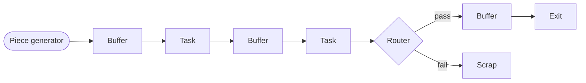
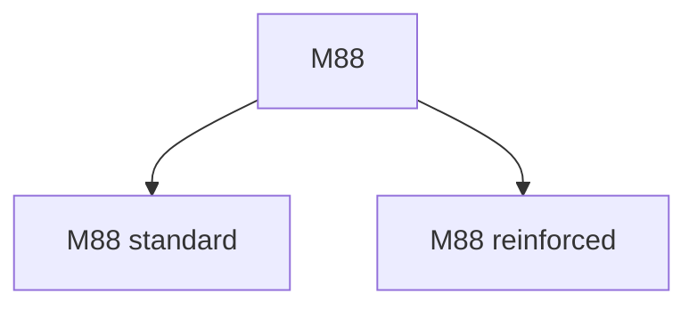
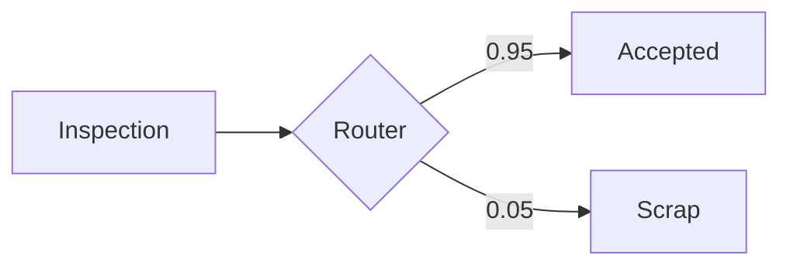
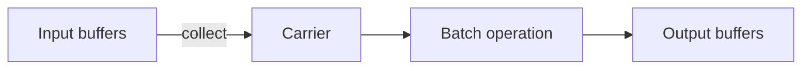
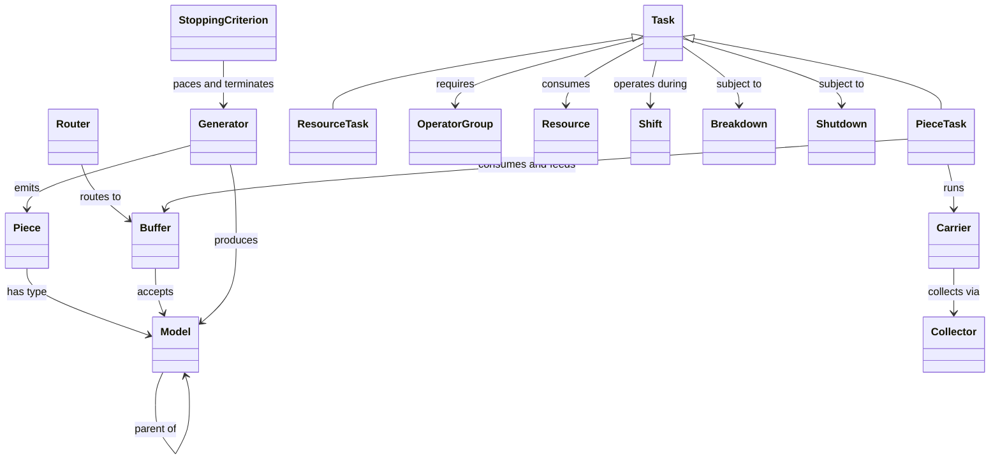
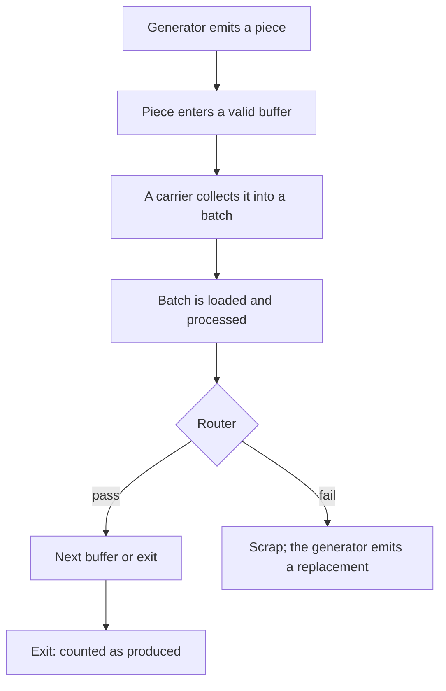

# Simulation Reference

This document describes the simulation model: its concepts, its components, and the meaning of every configuration setting. It is intended for users who need to understand the behavior of the simulation, not its source code.

Reading this document is a prerequisite for the [Flow Designer guide](flow-designer.en.md), which uses the concepts defined here without redefining them. The interpretation of run results is covered separately in the [KPI reference](kpis.en.md).

The model was originally developed for a wax injection and investment casting workshop, and some examples reflect that context. The model itself is domain independent: any process in which items move through stations and undergo operations can be represented.

---

## 1. Overview

The simulation represents a production line. Pieces are created by a generator, move through a network of buffers and tasks where they are processed, and terminate either at an exit buffer (counted as produced) or at a scrap buffer (discarded).

Two principles apply throughout:

- **Discrete event simulation.** Internal time is measured in simulated minutes. The engine advances from event to event (a piece arriving, an operation completing) rather than stepping through fixed increments. Multi-year horizons therefore execute in seconds.
- **Calendar anchoring.** The run is anchored to a start date. Every simulated instant corresponds to a real calendar date and time, and all dates in the reports are expressed in calendar terms.

---

## 2. Pieces and models

A **piece** is a single item flowing through the line. It is created by the generator and terminates at an exit or scrap buffer.

A **model** is the type of a piece, comparable to a product reference. Pieces of the same model are interchangeable; distinct models may follow different routes and have different processing parameters.

Models form a hierarchy. A model may declare a **parent**, and any component configured to accept a model also accepts all of its descendants. This allows common configuration at the family level, with per-variant overrides where required.

Models without children are **leaf models**. Generators produce leaf models only; parent models exist to designate groups in configuration.

---

## 3. Outlets: buffers and routers

Components deposit pieces into **outlets**. There are two kinds: buffers and routers.

### Buffers

A **buffer** is a queue in which pieces wait between operations. Each buffer declares a set of **valid models**; only pieces of those models (or their descendants) may enter.

A buffer has one of three types:

| Type | Role | Behavior |
|---|---|---|
| Passage | Intermediate queue | Pieces wait until a downstream task collects them |
| Exit | Terminal, production | Pieces are counted as produced; exactly one exit buffer per flow |
| Scrap | Terminal, rejection | Pieces are discarded |

Exit and scrap buffers are terminal: pieces never leave them.

### Routers

A **router** distributes incoming pieces across several outlet buffers according to probabilities. Routing is instantaneous; a router holds no pieces. The typical application is quality sorting after an inspection step.

One branch may be designated the **freeloader**. Its probability is not specified explicitly; it receives the remainder after all other branches, which guarantees that the total is 1 and remains correct when other branch probabilities are edited.

Branch probabilities may be constants or functions of time (see section 10), which allows the modeling of drifting rates such as a scrap rate that increases with tool wear.

---

## 4. Tasks

A **task** is a workstation. Two kinds exist, distinguished by what they operate on:

- A **piece task** processes pieces: it collects them from input buffers, performs an operation, and deposits them into output buffers.
- A **resource task** transforms materials: it consumes input resources and produces output resources. No individual pieces flow through it.

Piece tasks constitute the bulk of a typical flow; resource tasks supply the consumables. The following sections describe piece tasks first; section 9 covers what is specific to resource tasks.

### Carriers

Tasks process pieces in batches. The unit of batch processing is the **carrier**: a logical container, comparable to a tray or an oven rack, that collects a group of pieces, holds them through the operation, and deposits them at the output.

A task may run several carriers concurrently, subject to its capacity settings. This represents stations where multiple batches are in progress at the same time, such as curing or storage areas.

### Carrier lifecycle

Every carrier passes through the same stages. Run reports measure the time spent in each stage, so this lifecycle is the basis for interpreting task metrics.

1. **Startup.** Station preparation (preheating, setup). Startup occurs when the station begins operating, after any interruption, and at the start of each shift.
2. **Collection.** The carrier gathers pieces from the input buffers until its batch requirements are met or its timeout expires.
3. **Loading.** The batch is loaded onto the station. Loading takes time and may require operators.
4. **Processing.** The operation itself. Its duration may depend on the model and may require operators and resources.
5. **Deposit.** Completed pieces are placed into the output buffers.

If the station is interrupted during the cycle (breakdown, scheduled shutdown, end of shift), the carrier may be aborted and its pieces returned to a buffer, according to the configured policies (section 12).

### Collectors

The **collector** is the component of a carrier that performs the collection stage: it selects which pieces to take and determines when to stop waiting. Collector behavior is configurable and is described in section 6.

---

## 5. Task configuration

This section defines every piece task setting.

### Batch size (per model)

- **Minimum carrier capacity.** The smallest batch the carrier accepts before proceeding. A value of 1 allows single-piece operation.
- **Maximum carrier capacity.** The largest batch the carrier holds.

A station that always processes full racks of 4 uses minimum = maximum = 4. A station that starts with whatever is available, up to 4, uses minimum 1 and maximum 4.

### Station capacity

- **Max capacity.** The total number of piece slots available on the station, shared by all concurrent carriers. This setting determines the degree of parallelism: with max capacity 4 and carriers of 4, one carrier runs at a time; with max capacity 40, up to ten such carriers run concurrently.
- **Minimum carriers.** The number of carriers that must be ready before any of them launches, forming a wave. The usual value is 1.

Max capacity must be sufficient for a carrier's batch requirements; otherwise carriers can never assemble a batch and the station deadlocks. The Flow Designer validates this constraint.

### Carrier behavior flags

- **Contiguous carriers.** Determines slot reservation. When disabled, a carrier reserves its full maximum footprint while collecting, making those slots unavailable to other carriers. When enabled, a carrier occupies only the slots corresponding to pieces currently held.
- **Independent carriers.** Determines synchronization. Independent carriers run their lifecycles on separate timelines; non-independent carriers advance together as a group.

Ordinary single-batch stations can leave both flags at their defaults. The flags primarily concern parallel storage and waiting areas.

### Durations

Three durations, each specified as a probability distribution (section 10):

- **Startup duration.** Preparation time.
- **Loading duration.** Batch loading time.
- **Processing duration.** Operation time, configured per model.

### Timeout

The **timeout** bounds the collection stage. When it expires, the carrier proceeds with the pieces collected so far; if it holds none, it continues to wait for at least one piece. An infinite timeout means the carrier waits indefinitely for its minimum batch.

> **Warning.** The timeout is evaluated within an active collection attempt. If the station leaves its shift, the attempt is interrupted and the timeout restarts on the next attempt. A timeout longer than the station's working window may therefore never expire. To flush partial batches, choose a timeout shorter than the shift during which the station operates.

### Priority

An integer from 0 to 10; 10 is the highest. When several tasks compete for the same scarce entity (slots, pieces, materials) at the same instant, the higher-priority task is served first.

> **Note.** Whether priority also arbitrates competition for operator groups depends on the engine version in use. When a station's access to shared personnel is critical, the reliable approach is a dedicated operator group rather than a shared one.

### Admin flag

Marks the task as **administrative** (inspection, waiting, holding, storage) rather than productive. The flag has no effect on simulation behavior; it only determines the task's grouping in the administrative-versus-productive summary report (see the [KPI reference](kpis.en.md)).

---

## 6. Collector types

Collector behavior combines two independent choices.

**Greedy versus altruistic** governs the willingness to settle for a partial batch:

- A **greedy** collector, once its minimum batch is met, tops up toward the maximum with pieces that are immediately available, then proceeds without further waiting.
- An **altruistic** collector waits longer to assemble a fuller batch.

**Discriminating versus non-discriminating** governs model selection:

- A **non-discriminating** collector accepts any valid piece and may mix models in one batch. This requires all accepted models to share the same processing duration and batch sizes, since the batch is processed as a unit.
- A **discriminating** collector selects one focus model per batch and collects only that model.

The four combinations of these choices are the four collector types.

A discriminating collector selects its focus model according to a configurable rule:

- **Most present.** The model with the most pieces currently waiting.
- **Fastest task duration.** The model with the shortest processing time.
- **Smallest gap to minimum capacity.** The model closest to filling its minimum batch.

Within the focus, individual pieces are selected according to the **piece exit order**: **first in, first out** (longest wait in the buffer) or **first created, first out** (earliest creation time).

---

## 7. Operators

An **operator group** represents a team of interchangeable workers.

- The group has a **size**, a set of **shifts** defining its working hours, and a **productivity** factor that scales operation speed (1.0 is nominal; values may be distributions).
- Outside its shifts, the group is unavailable, and stations requiring it wait for its return.

Tasks reference operators through **alternatives**: an ordered list of acceptable groups. The first alternative with sufficient available personnel is used. Alternatives model cross-trained staff and fallback coverage. All operators within one alternative must share the same productivity.

Operators may be required at three points of the carrier lifecycle, each with its own alternatives: **startup operators**, **loading operators**, and **processing operators**.

### Operator scope

The **operator scope** defines how long a task retains its personnel:

- **Per batch.** Operators are requested for a specific job (loading a batch, processing a batch) and released when that job completes. Personnel circulate freely between stations.
- **Per task.** The task claims a crew and retains it across successive batches, releasing it when the task idles past the crew's shift boundary or stops. This represents personnel posted to a station for a shift.

The distinction is reflected in labor accounting: a per-task crew is counted as occupied for its entire posting, including idle intervals between batches, whereas a per-batch crew is counted only during its jobs.

Operator scope cannot be per unit, and resource scope cannot be per task; these combinations are rejected at load time.

---

## 8. Resources

A **resource** is a consumable material or reusable fixture (liquid wax, slurry, molds). Tasks may require resources to operate.

Properties:

- **Capacity** and **initial amount**.
- **Lifespan.** The usable lifetime of a unit. An infinite lifespan disables expiry; a finite lifespan models perishable material.

A **restockable resource** reorders automatically. When stock falls below its **threshold**, an order is placed; after the **order duration** and the **delivery duration** elapse, stock is replenished to capacity. Tasks that require an exhausted resource wait, and this waiting appears in the reports as material wait time, inclusive of reordering delays.

---

## 9. Resource tasks

A resource task transforms materials. Its specific settings:

- **Non-transformed resources.** Materials that must be present but are not consumed.
- **Transformed resources.** Materials consumed as input, each with a **proportion** defining its share of the mix. Proportions describe a recipe and sum to 1.
- **Salvageable.** Per transformed resource, whether unused surplus is recovered rather than lost.
- **Output resources.** Produced quantities, specified as a bounded distribution.

Operators, durations, shifts, and interruptions behave as for piece tasks. Resource tasks use a simplified collector with only the greedy versus altruistic choice.

---

## 10. Distributions, time functions, and reproducibility

Most numeric parameters accept a **probability distribution** rather than a fixed value:

| Distribution | Characteristics | Typical use |
|---|---|---|
| Constant | Fixed value | Exact durations |
| Uniform | Equally likely within [low, high] | Bounded uncertainty |
| Normal | Bell curve around a mean | Natural variation |
| Exponential | Many short values, few long | Inter-event times |
| Triangular | Low, mode, high | Three-point estimates |
| LogNormal | Right-skewed, positive | Occasionally long durations |

Certain parameters additionally accept **time functions**: values that evolve over the run following a linear, exponential, or step profile. Applications include drifting scrap rates and production ramp-ups.

Each run uses a **seed** that initializes the random number generator. Identical seed and model produce an identical run; changing the seed yields an independent realization. Use a fixed seed for reproducibility and multiple seeds to assess variability.

---

## 11. Shifts and the calendar

A **shift** defines working hours for a task, a generator, or an operator group. Outside its shifts, the entity is inactive.

Two definition modes:

- **Weekly.** A repeating weekly pattern applied over a date range.
- **Custom.** Explicit date-time intervals.

Both modes accept **days off**: calendar dates, drawn from a shared closing-days registry, on which the schedule does not apply.

Shifts are the primary link between the model and the calendar. When production stalls or an entity appears underutilized, shift configuration is the first element to verify.

---

## 12. Interruptions

### Breakdowns

A **breakdown** is an unplanned random failure, characterized by:

- **Mean time between failures (MTBF).**
- **Mean time to repair (MTTR).**

On failure, current work is interrupted. For a piece task, in-progress pieces are deposited into designated **lifeboat outlets** rather than lost. The station resumes after repair.

### Shutdowns

A **shutdown** is a planned stop (maintenance, cleaning). Two variants:

- **Non-flexible.** Occurs exactly as scheduled; in-progress work is interrupted.
- **Flexible.** May shift slightly to allow the current batch to complete before stopping.

Shutdowns are specified either as explicit intervals or generated periodically (interval, duration, date range).

In reporting terms, shutdowns are planned losses, deducted from required time before availability is computed, whereas breakdowns are unplanned losses that reduce availability. See the [KPI reference](kpis.en.md).

---

## 13. The piece generator

Each flow contains exactly one **piece generator**, the source of all pieces. It emits during its own shifts, into its configured outlet buffers. The emission regime is determined by the stopping criterion (section 14) and operates in one of two modes.

### Goal mode

Each leaf model receives a target count of good pieces. The generator paces emission by a **gap** (the interval between pieces), either set manually or computed automatically from the total goal and the available working time.

- **Grace period.** With an automatic gap, a grace period may be reserved: a portion of working time at the end of the horizon excluded from the pacing computation. It provides slack for the line to drain and for scrapped pieces to be remade before the deadline.
- **Scrap-aware remaking.** The generator monitors scrap. A scrapped piece leaves its goal unmet, and the generator emits a replacement. Goals are therefore expressed in good pieces delivered; the number of injected pieces may exceed the goal by the number of scraps.

> **Note.** The grace period functions as a remake budget. Each remake consumes part of it, so a high scrap rate can exhaust the grace period before all replacements complete, ending the run short of its goal. Size the grace period according to the expected scrap count.

### Rate mode

The generator emits at a specified **gap** (possibly a time function) with a **model mix** giving each model's share. One model may be the freeloader, receiving the residual share. Rate mode serves the study of a line under a given input stream, without production targets.

---

## 14. Stopping criteria

The **stopping criterion** ends the run.

- **By time.** The run ends at a specified date. Used with rate mode.
- **By pieces produced.** The run ends when the exit buffer reaches the total goal. Used with goal mode. A **timeout** provides an upper bound: if the goal is not reached by the timeout, the run ends and the reports reflect the partial result.

An additional safeguard applies to unbounded runs: if the timeout is infinite and no piece reaches the exit for an extended span of simulated time, the run terminates with an explicit error rather than continuing indefinitely.

---

## 15. Component relationships

Piece lifecycle:

---

## Further reading

- Building and running models: [Flow Designer guide](flow-designer.en.md).
- Interpreting run outputs: [KPI reference](kpis.en.md).

When results deviate from expectations, verify, in order: shift configuration (an entity was closed), operator availability, buffer accumulation (a downstream bottleneck), and the grace period relative to the scrap rate. These four causes account for the large majority of unexpected outcomes.
