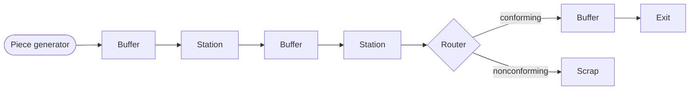
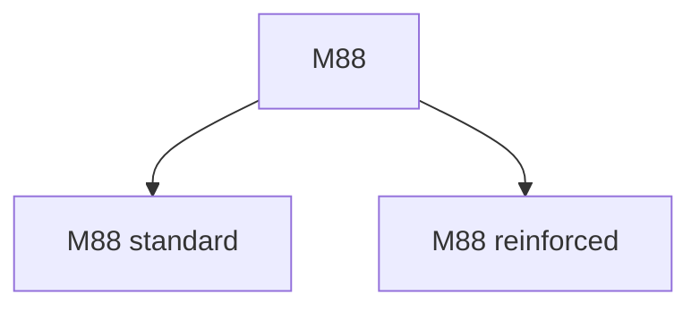
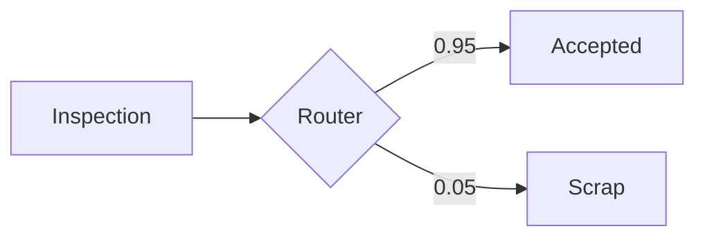
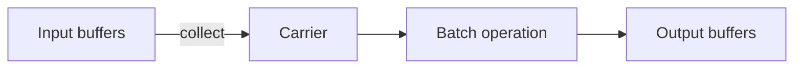
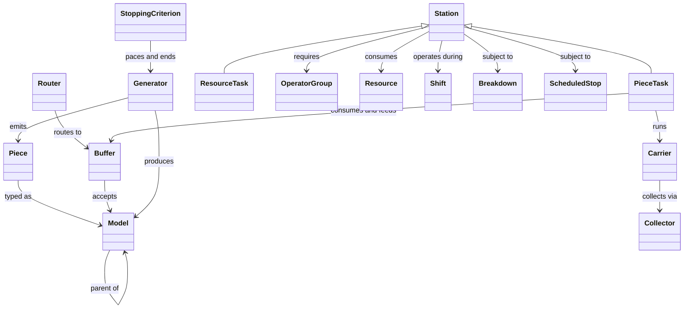
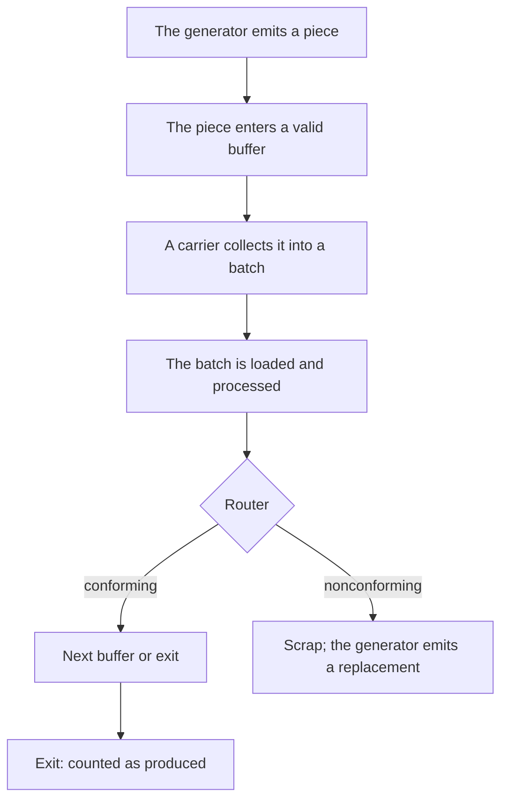

# Simulation Reference

This document describes the simulation model: its concepts, its components, and the meaning of every configuration setting. It is written for users who need to understand the simulation's behavior, not its source code.

Reading this document is a prerequisite for the [Flow Designer guide](flow-designer.en.md), which uses the concepts defined here without redefining them. Interpreting run results is covered separately in the [KPI reference](kpis.en.md).

The model was originally developed for a wax injection and lost-wax casting workshop, and some examples reflect that context. The model itself is domain-independent: any process in which items travel through stations and undergo operations can be represented.

---

## 1. Overview

The simulation represents a production line. Pieces are created by a generator, travel through a network of buffers and stations where they are processed, and finish either in an exit buffer (counted as produced) or in a scrap buffer (discarded).

Two principles apply throughout:

- **Discrete-event simulation.** Internal time is measured in simulated minutes. The engine advances from event to event (a piece arriving, an operation finishing) rather than in fixed increments. Horizons of several years therefore run in seconds.
- **Calendar anchoring.** A run is anchored to a start date. Every simulated instant corresponds to a real date and time, and all report dates are expressed in calendar terms.

---

## 2. Pieces and models

A **piece** is an individual item traveling on the line. It is created by the generator, given its own identifier, and tracked individually until it finishes in an exit or scrap buffer.

A **model** is a piece's type, comparable to a product reference. Two pieces of the same model share the same configuration (routes, durations, batch sizes) and are processed the same way, but each remains a distinct item with its own identifier. Distinct models may follow different routes and have different processing parameters.

Models form a hierarchy. A model may declare a **parent**, and any component configured to accept a model also accepts all of its descendants. This allows shared configuration at the family level, with per-variant overrides where needed.

Models with no children are the **leaf models**. Generators produce only leaf models; parent models serve to designate groups in configuration.

---

## 3. Outlets: buffers and routers

Components deposit pieces into **outlets**. There are two kinds: buffers and routers.

### Buffers

A **buffer** is a queue in which pieces wait between two operations. Each buffer declares a set of **valid models**; only pieces of those models (or their descendants) may enter.

A buffer has one of three types:

| Type | Role | Behavior |
|---|---|---|
| Passage | Intermediate queue | Pieces wait for a downstream station to collect them |
| Exit | Terminal, production | Pieces are counted as produced; exactly one exit buffer per flow |
| Scrap | Terminal, rejection | Pieces are discarded |

Exit and scrap buffers are terminal: pieces never leave them.

### Routers

A **router** distributes incoming pieces across several outlet buffers according to probabilities. Routing is instantaneous; a router holds no pieces. The typical application is quality sorting after an inspection step.

One branch may be designated the **freeloader**. Its probability is not specified explicitly; it receives the remainder of the other branches, which guarantees a total of 1 and stays correct when the other probabilities change.

Branch probabilities may be constants or time functions (see section 10), which allows drifting rates to be modeled, for example a scrap rate rising with tool wear.

---

## 4. Resources

A **resource** is a consumable material or a reusable piece of equipment (liquid wax, slurry, molds). Stations may require resources to operate.

Properties:

- **Capacity** and **initial amount**.
- **Lifespan.** How long one unit stays usable. An infinite lifespan disables expiry; a finite one models a perishable material.

A **restockable resource** reorders itself automatically. When stock falls below its **threshold**, an order is placed; after the **order duration** and then the **delivery duration** elapse, stock is restored to capacity.

> **Note.** A station requiring a depleted resource waits. During the order duration, the affected carrier waits and the operators already requisitioned for it stay reserved (they do not go work elsewhere). This wait appears in the reports as material wait, reorder delays included.

### Resource scope

The **resource scope** defines how a station sizes the quantity of resources it consumes:

- **Per batch.** A fixed quantity per batch, independent of the number of pieces.
- **Per unit.** A quantity proportional to the number of pieces in the batch.

Resource scope cannot be per task.

---

## 5. Operators

An **operator group** represents a team of interchangeable workers.

- The group has a **headcount**, a set of **shifts** defining its working hours, and a **productivity** factor that scales operation speed (1.0 is nominal; values may be distributions).
- Outside its shifts, the group is unavailable, and stations requiring it wait for its return.

Stations reference operators through **alternatives**: an ordered list of acceptable groups. The first alternative with sufficient available personnel is used. Alternatives model cross-trained staff and fallback coverage. All operators within one alternative must share the same productivity.

Operators may be required at three moments of a batch's processing, each with its own alternatives: **startup operators**, **loading operators**, and **processing operators**.

> **Note.** Operator allocation does not consider station priority (section 7). When several stations request the same team at the same instant, personnel is allocated in request order, without favoring the higher-priority station.

### Operator scope

The **operator scope** defines how long a station retains its personnel:

- **Per batch.** Operators are requested for a specific job (load a batch, process a batch) and released when that job ends. Personnel move freely between stations.
- **Per task.** The station requisitions a crew and keeps it across successive batches, releasing it when the station idles past the crew's shift boundary or stops. This represents personnel posted to a station for a shift.

The distinction is reflected in labor accounting: a per-task crew is counted occupied over its entire posting, including idle intervals between batches, whereas a per-batch crew is counted only during its jobs.

Operator scope cannot be per unit, and resource scope cannot be per task; these combinations are rejected at load time.

---

## 6. Stations

A **station** is a workstation. There are two kinds, distinguished by what they operate on:

- A **piece task** processes pieces: it collects them from input buffers, performs an operation, and deposits them into output buffers.
- A **resource task** transforms materials: it consumes input resources and produces output resources. No individual piece passes through it.

Piece tasks make up the bulk of a typical flow; resource tasks supply the consumables. The following sections describe piece tasks first; section 9 covers the specifics of resource tasks.

### Carriers

Stations process pieces in batches. The unit of batch processing is the **carrier**: a logical container, comparable to a tray or an oven rack, that gathers a group of pieces, holds them during the operation, and deposits them at the output.

A station may run several carriers simultaneously, within the limit of its capacity settings. This represents stations where several batches are in progress at once, such as drying or storage areas.

### Carrier lifecycle

Every carrier goes through the same steps. Run reports measure the time spent in each, so this cycle is the basis for interpreting station metrics.

1. **Collection.** The carrier gathers pieces from the input buffers until it meets its batch requirements or its timeout expires.
2. **Loading.** The batch is loaded onto the station. Loading takes time and may require operators.
3. **Processing.** The operation itself. Its duration may depend on the model and may require operators and resources.
4. **Deposit.** The finished pieces are placed in the output buffers.

> **Note.** **Startup** (station preparation: preheating, setup) is not part of a carrier's cycle. It is performed by the station itself, at start, after any interruption, and at the beginning of each shift, before any carrier is formed. It is nonetheless measured and reported per station (the `mise_en_route` column).

If the station is interrupted during the cycle (breakdown, scheduled stop, shift end), the carrier may be aborted and its pieces returned to a buffer, according to the configured protocols (section 12).

### Collectors

The **collector** is the component of a carrier that performs the collection step: it selects which pieces to take and decides when to stop waiting. Collector behavior is configurable and described in section 8.

---

## 7. Station configuration

This section defines every setting of a piece task.

### Batch size (per model)

- **Minimum carrier capacity.** The smallest batch the carrier accepts before proceeding. A value of 1 allows piece-by-piece operation.
- **Maximum carrier capacity.** The largest batch the carrier holds.

A station that always processes full racks of 4 uses minimum = maximum = 4. A station that starts with whatever is available, up to 4, uses minimum = 1 and maximum = 4.

### Station capacity

- **Max capacity.** The total number of piece slots the station has, shared by all simultaneous carriers. This setting determines the degree of parallelism: with a max capacity of 4 and carriers of 4, one carrier runs at a time; with 40, up to ten such carriers run in parallel.
- **Minimum carriers.** The number of carriers that must be ready before any starts, forming a wave. The usual value is 1.

Max capacity must be enough for one carrier's batch requirements; otherwise carriers can never form their batch and the station deadlocks. The Flow Designer validates this constraint.

### Carrier behavior flags

- **Contiguous carriers.** Determines slot reservation. Disabled, a carrier reserves its full maximum footprint during collection, making those slots unavailable to others. Enabled, a carrier occupies only the slots for the pieces it actually holds.

  > **Example.** A drying area of 40 slots fed by carriers of 4 pieces. Contiguous carriers enabled: a carrier still collecting occupies only the slots of the pieces it has already taken, leaving the rest free for other carriers, filling the area best. Contiguous carriers disabled: each carrier blocks its 4 slots from the start, even half-full, reserving capacity but underusing it during collection.

- **Independent carriers.** Determines synchronization. Independent carriers run their cycles on separate timelines; non-independent carriers advance together.

  > **Example.** Independent carriers each move at their own pace: one tray can leave the oven while another enters. Non-independent carriers form a synchronous wave: all start and finish together, like the cavities of a single mold sharing one cycle.

Ordinary single-batch stations can leave both settings at their defaults. They mainly concern parallel storage and waiting areas.

### Durations

Three durations, each specified as a probability distribution (section 10):

- **Startup duration.** Preparation time, performed once at (re)start of the station, not for every batch.
- **Loading duration.** Time to load the batch.
- **Processing duration.** Operation time, configured per model.

### Timeout

The **timeout** bounds the collection step. On expiry, the carrier proceeds with the pieces collected; if it holds none, it keeps waiting for at least one piece. An infinite timeout means the carrier waits indefinitely for its minimum batch.

> **Warning.** The timeout is evaluated within an active collection attempt. If the station leaves its shift, the attempt is interrupted and the timeout restarts on the next attempt. A timeout longer than the station's working window may therefore never expire. To evacuate partial batches, choose a timeout shorter than the shift during which the station operates.

### Priority

An integer from 0 to 10; 10 is the highest. When several stations contend for the same scarce entity (slots, pieces) at the same instant, the higher-priority station is served first.

> **Note.** Priority arbitrates contention for slots and pieces. It does not apply to operator groups: personnel is allocated without regard to priority, in request order. When a station's access to shared personnel is critical, the reliable approach is a dedicated operator group rather than a shared one.

### The Admin flag

Marks the station as **administrative** (inspection, waiting, holding, storage) rather than productive. This flag has no effect on simulation behavior; it only determines the station's grouping in the administrative-versus-productive summary report (see the [KPI reference](kpis.en.md)).

---

## 8. Collector types

Collector behavior combines two independent choices.

**Greedy versus altruistic** governs when the collector reserves pieces:

- A **greedy** collector reserves pieces as they come, one at a time, the moment they become available, without waiting for a whole minimum batch to be present. It can thereby monopolize pieces and slow other collectors working in parallel.
- An **altruistic** collector waits until at least a minimum batch of pieces is available before reserving them. It thus gives other collectors, whose minimum batch is smaller, the chance to serve themselves first.

In both cases, once the minimum batch is reached, the collector tops up toward the maximum with immediately available pieces, then proceeds.

**Discriminating versus non-discriminating** governs model selection:

- A **non-discriminating** collector accepts any valid piece and may mix models in a batch. This requires all accepted models to share the same processing duration and batch sizes, the batch being treated as one unit.
- A **discriminating** collector selects one focus model per batch and collects only that model.

The four combinations of these choices are the four collector types.

A discriminating collector selects its focus model by a configurable rule (this rule has an effect only for a discriminating collector):

- **Most present.** The model with the most pieces waiting.
- **Fastest processing duration.** The model with the fastest processing.
- **Smallest gap to minimum capacity.** The model closest to filling its minimum batch.

Within the focus, individual pieces are selected by the **piece exit order**: **first in, first out** (longest wait in the buffer) or **first created, first out** (earliest creation date).

---

## 9. Resource tasks

A resource task transforms materials. Its specific settings:

- **Non-transformed resources.** Materials that must be present and are consumed at the operation, but do not enter the composition of the output resource. Examples: electricity, consumables or fluids used by the machine.
- **Transformed resources.** Materials consumed as input, each with a **proportion** defining its share of the mix. Proportions describe a recipe and sum to 1.
- **Salvageable.** Per transformed resource: whether the reserved-but-unconsumed quantity is recovered (returned to stock) rather than lost when the carrier is aborted or when the mix is rebalanced.
- **Output resources.** For each produced resource, a bounded distribution defines a (positive) coefficient applied to the input quantity consumed by the carrier. The produced quantity is therefore proportional, within a random factor, to the quantity of transformed resources consumed.

Operators, durations, shifts, and interruptions behave as for piece tasks. Resource tasks use a simplified collector with only the greedy-versus-altruistic choice.

---

## 10. Distributions, time functions, and reproducibility

Most numeric parameters accept a **probability distribution** rather than a fixed value:

| Distribution | Characteristics | Typical use |
|---|---|---|
| Constant | Fixed value | Exact durations |
| Uniform | Equiprobable in [low, high] | Bounded uncertainty |
| Normal | Bell around a mean | Natural variation |
| Exponential | Many short values, few long | Inter-event times |
| Triangular | Low, mode, high | Three-point estimates |
| LogNormal | Right-skewed, positive | Occasionally very long durations |

Some parameters also accept **time functions**: values that evolve over the run. They serve in particular to model a ramp-up, a duration or probability that changes early in the horizon, or a drifting scrap rate. Moreover, the parameters of a probability distribution may themselves be time functions: for example, the mean of a Normal distribution may decrease over the run.

| Time function | Shape | Typical use |
|---|---|---|
| Linear | Constant-slope variation between two points | Gradual ramp-up |
| Step | Constant in steps, advancing one notch at a fixed interval | Periodic discrete changes |
| Exponential | Asymptotic approach to a limit | Rise or decay that saturates |

Each run uses a **seed** that initializes the random-number generator. Identical seed and model produce an identical run on the same engine; changing the seed gives an independent realization. Use a fixed seed for reproducibility and several seeds to assess variability.

> **Note.** A given seed reproduces an identical run only for a given engine. The Python and C++ engines do not use the same random-number generator; at an equal seed they produce different but statistically comparable realizations.

---

## 11. Shifts and the calendar

A **shift** defines the working hours of a station, a generator, or an operator group. Outside its shifts, the entity is inactive.

> **Note.** The shifts of a station and of the piece generator represent their **opening time**: the periods during which the station is open or the generator emits. They are distinct from the shifts of an operator group, which represent the personnel's presence hours. An open station whose operators are off shift waits for its crew.

Two definition modes:

- **Weekly.** A repeating weekly pattern, applied over a date range.
- **Custom.** Explicit date-time intervals.

Both modes accept **days off**: calendar dates, drawn from a shared registry, on which the schedule does not apply.

Shifts are the main link between the model and the calendar. When production stalls or an entity appears underused, shift configuration is the first thing to check.

---

## 12. Interruptions

### Breakdowns

A **breakdown** is a random, unplanned failure, characterized by a **mean time between failures (MTBF)** and a **mean time to repair (MTTR)**.

The MTBF is specified in one of two ways:

- By a **probability distribution** (the time to the next breakdown is drawn from that distribution).
- By a **bathtub curve** of the failure rate. The failure rate is the instantaneous rate of breakdowns; it is high during running-in (infant mortality), low and roughly constant during useful life, then rising at wear-out. The time to the next breakdown is drawn from the Poisson process corresponding to this rate. The curve takes five parameters:

| Parameter | Role |
|---|---|
| a | Amplitude of the running-in term: the initial height of the failure rate at start. |
| tau | Time constant of running-in: how fast infant mortality decays. |
| c | Constant baseline: the flat bottom of the tub, the random failures of useful life. |
| beta | Shape of the wear-out term (Weibull): the steepness of the late-life rise. |
| eta | Scale of the wear-out term: the characteristic life, where wear-out sets in. |

On a failure, the work in progress is interrupted. For a piece task, in-progress pieces are deposited into designated **lifeboat outlets** rather than lost. The station resumes after repair.

### Scheduled stops (shutdowns)

A **scheduled stop** is a planned stop (maintenance, cleaning). Two variants:

- **Non-flexible.** Occurs exactly as planned; the work in progress is interrupted.
- **Flexible.** May slide slightly to let the current batch finish before the stop.

Stops are specified either as explicit intervals or generated periodically (interval, duration, date range).

In reporting terms, scheduled stops are planned losses, deducted from required time before availability is computed, whereas breakdowns are unplanned losses that reduce availability. See the [KPI reference](kpis.en.md).

---

## 13. The piece generator

Each flow contains exactly one **piece generator**, the source of all pieces. It emits during its own shifts, toward its configured destination buffers. The emission regime is determined by the stopping criterion (section 14) and operates in one of two modes.

### Goal mode

Each leaf model receives a goal of good pieces. The generator paces emission by a **gap** (the interval between two created pieces), set manually or computed automatically from the total goal and the available working time.

- **The grace period.** With an automatic gap, a grace period may be reserved: a portion of the working time at the end of the horizon excluded from the pace calculation. It provides slack for the line to drain and for scrapped pieces to be remade before the deadline.
- **Scrap-aware remaking.** The generator monitors scrap. A scrapped piece leaves its goal unmet, and the generator emits a replacement. Goals are therefore expressed in good pieces delivered; the number of pieces injected may exceed the goal by the number of scraps.

> **Note.** The grace period acts as a remaking budget. Each remake consumes part of it; a high scrap rate can therefore exhaust the grace period before all replacements complete, ending the run short of its goal. Size the grace period according to the expected number of scraps.

### Rate mode

The generator emits at a specified **gap** (possibly a time function) with a **model mix** giving each model's share. One model may be the freeloader, receiving the residual share. Rate mode is used to study a line under a given input flow, without production goals.

---

## 14. Stopping criteria

The **stopping criterion** terminates the run.

- **By time.** The run ends at a specified date. Used with rate mode.
- **By pieces produced.** The run ends when the exit buffer reaches the total goal. Used with goal mode. A **timeout** provides an upper bound: if the goal is not reached by the timeout, the run ends and the reports reflect the partial result.

> **Note.** When the timeout is infinite, the end of the run is determined by reaching the goal: the criterion detects that the exit buffer has reached the target total and terminates the run. It is neither a fixed duration nor the exhaustion of events (the generator keeps emitting as long as the goal is unmet). A safeguard is added: if no piece reaches the exit for a long span of simulated time, the run stops with an explicit error rather than running forever. This is a safety valve against a stalled run, not the normal termination mechanism.

---

## 15. Relationships between components

Piece lifecycle:

---

## Further reading

- Building and running models: [Flow Designer guide](flow-designer.en.md).
- Interpreting run outputs: [KPI reference](kpis.en.md).
