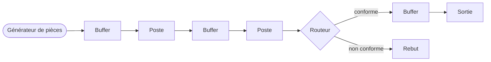
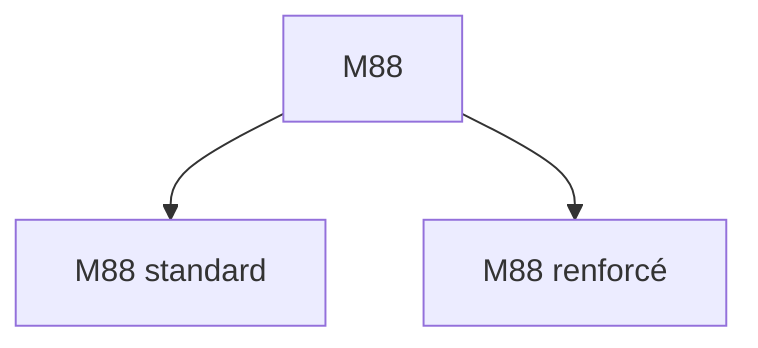
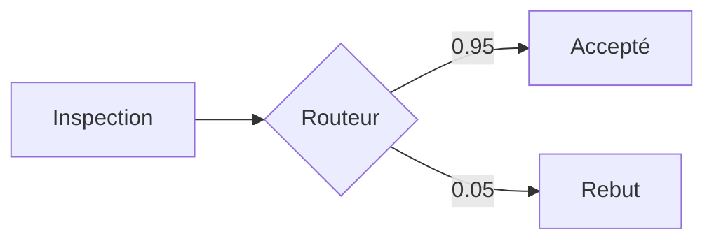
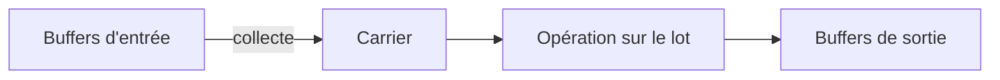
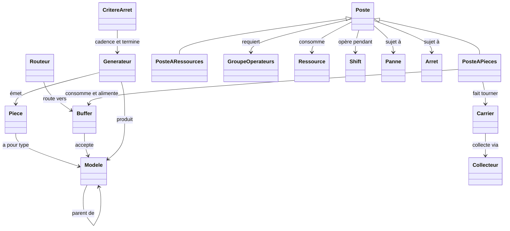
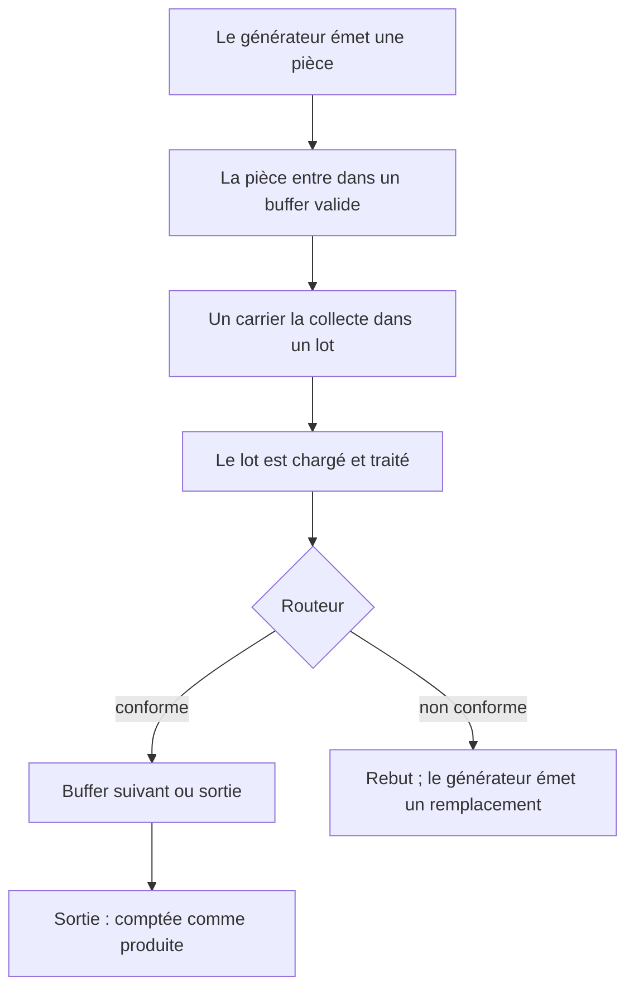

# Référence de la simulation

Ce document décrit le modèle de simulation : ses concepts, ses composants, et la signification de chaque réglage de configuration. Il s'adresse aux utilisateurs qui ont besoin de comprendre le comportement de la simulation, pas son code source.

La lecture de ce document est un prérequis au [guide du Flow Designer](flow-designer.fr.md), qui emploie les concepts définis ici sans les redéfinir. L'interprétation des résultats d'exécution est traitée séparément dans la [référence des KPI](kpis.fr.md).

Le modèle a été développé à l'origine pour un atelier d'injection de cire et de fonderie à la cire perdue, et certains exemples reflètent ce contexte. Le modèle lui-même est indépendant du domaine : tout process dans lequel des articles traversent des stations et subissent des opérations peut être représenté.

---

## 1. Vue d'ensemble

La simulation représente une ligne de production. Les pièces sont créées par un générateur, traversent un réseau de buffers et de postes où elles sont traitées, et terminent soit dans un buffer de sortie (comptées comme produites), soit dans un buffer de rebut (éliminées).

Deux principes s'appliquent partout :

- **Simulation à événements discrets.** Le temps interne se mesure en minutes simulées. Le moteur avance d'événement en événement (arrivée d'une pièce, fin d'une opération) plutôt que par incréments fixes. Des horizons de plusieurs années s'exécutent donc en quelques secondes.
- **Ancrage calendaire.** L'exécution est ancrée à une date de début. Chaque instant simulé correspond à une date et heure réelles, et toutes les dates des rapports sont exprimées en termes calendaires.

---

## 2. Pièces et modèles

Une **pièce** est un article individuel circulant sur la ligne. Elle est créée par le générateur et termine dans un buffer de sortie ou de rebut.

Un **modèle** est le type d'une pièce, comparable à une référence produit. Les pièces d'un même modèle sont interchangeables ; des modèles distincts peuvent suivre des routes différentes et avoir des paramètres de traitement différents. (LE TERME INTERCHANGEABLES PORTE A CONFUSION ICI, ON POURRAIT PENSER A TORT QUE CA VEUT DIRE QUE LES PIECES D'UN MEME MODELE SONT LPAREILLE ALORS QU'ELLES SONT CARACTERISEES CHACUNES PAR UN ID DIFFERENT: REFORMULER LA PHARSE CORRECTEMENT)

Les modèles forment une hiérarchie. Un modèle peut déclarer un **parent**, et tout composant configuré pour accepter un modèle accepte également l'ensemble de ses descendants. Cela permet une configuration commune au niveau de la famille, avec des surcharges par variante lorsque nécessaire.

Les modèles sans enfants sont les **modèles feuilles**. Les générateurs ne produisent que des modèles feuilles ; les modèles parents servent à désigner des groupes dans la configuration.

---

## 3. Les outlets : buffers et routeurs

Les composants déposent les pièces dans des **outlets**. Il en existe deux sortes : les buffers et les routeurs.

### Les buffers

Un **buffer** est une file dans laquelle les pièces attendent entre deux opérations. Chaque buffer déclare un ensemble de **modèles valides** ; seules les pièces de ces modèles (ou de leurs descendants) peuvent y entrer.

Un buffer possède l'un de trois types :

| Type | Rôle | Comportement |
|---|---|---|
| Passage | File intermédiaire | Les pièces attendent qu'un poste aval les collecte |
| Sortie (Exit) | Terminal, production | Les pièces sont comptées comme produites ; exactement un buffer de sortie par flux |
| Rebut (Scrap) | Terminal, rejet | Les pièces sont éliminées |

Les buffers de sortie et de rebut sont terminaux : les pièces n'en repartent jamais.

### Les routeurs

Un **routeur** répartit les pièces entrantes entre plusieurs buffers de destination selon des probabilités. Le routage est instantané ; un routeur ne retient aucune pièce. L'application typique est le tri qualité après une étape d'inspection.

Une branche peut être désignée **freeloader**. Sa probabilité n'est pas spécifiée explicitement ; elle reçoit le reliquat des autres branches, ce qui garantit un total de 1 et reste correct lorsque les autres probabilités sont modifiées.

Les probabilités de branche peuvent être des constantes ou des fonctions du temps (voir section 10), ce qui permet de modéliser des taux dérivants, par exemple un taux de rebut qui augmente avec l'usure de l'outillage.

---

## 4. Les postes

Un **poste** est une station de travail. Il en existe deux sortes, distinguées par ce sur quoi elles opèrent :

- Un **poste à pièces** traite des pièces : il les collecte dans des buffers d'entrée, effectue une opération, et les dépose dans des buffers de sortie.
- Un **poste à ressources** transforme des matières : il consomme des ressources d'entrée et produit des ressources de sortie. Aucune pièce individuelle ne le traverse.

Les postes à pièces constituent l'essentiel d'un flux typique ; les postes à ressources fournissent les consommables. Les sections suivantes décrivent d'abord les postes à pièces ; la section 9 couvre les spécificités des postes à ressources.

### Les carriers

Les postes traitent les pièces par lots. L'unité de traitement par lot est le **carrier** : un conteneur logique, comparable à un plateau ou à une grille de four, qui rassemble un groupe de pièces, les maintient pendant l'opération, et les dépose en sortie.

Un poste peut faire tourner plusieurs carriers simultanément, dans la limite de ses réglages de capacité. Cela représente les stations où plusieurs lots sont en cours en même temps, telles que les zones de séchage ou de stockage.

### Cycle de vie d'un carrier

Chaque carrier traverse les mêmes étapes. Les rapports d'exécution mesurent le temps passé dans chacune, ce cycle est donc la base de l'interprétation des indicateurs de poste.

1. **Mise en route.** Préparation de la station (préchauffage, réglage). La mise en route a lieu au démarrage de la station, après toute interruption, et au début de chaque shift. (LA MISE EN ROUTE N'EST PAS VRAIMENT DANS LE CYCLE DE VIE DU CARRIER, C'ES PLUTOT FAIT DANS LA TASK, LE CARRIER N'EST PAS ENCORE CREE QUAND ON EFFECTUE LE STARTUP)
2. **Collecte.** Le carrier rassemble des pièces depuis les buffers d'entrée jusqu'à satisfaire ses exigences de lot ou jusqu'à expiration de son timeout.
3. **Chargement.** Le lot est chargé sur la station. Le chargement prend du temps et peut requérir des opérateurs.
4. **Traitement.** L'opération elle-même. Sa durée peut dépendre du modèle et peut requérir des opérateurs et des ressources.
5. **Dépôt.** Les pièces terminées sont placées dans les buffers de sortie.

Si la station est interrompue pendant le cycle (panne, arrêt programmé, fin de shift), le carrier peut être abandonné et ses pièces renvoyées dans un buffer, selon les politiques configurées (section 12).

### Les collecteurs

Le **collecteur** est le composant d'un carrier qui effectue l'étape de collecte : il sélectionne les pièces à prendre et détermine quand cesser d'attendre. Le comportement du collecteur est configurable et décrit en section 6.

---

## 5. Configuration d'un poste

Cette section définit chaque réglage d'un poste à pièces.

### Taille de lot (par modèle)

- **Capacité minimale du carrier.** Le plus petit lot que le carrier accepte avant de procéder. La valeur 1 autorise le fonctionnement à la pièce.
- **Capacité maximale du carrier.** Le plus grand lot que le carrier contient.

Une station qui traite toujours des grilles pleines de 4 utilise minimum = maximum = 4. Une station qui démarre avec ce qui est disponible, jusqu'à 4, utilise minimum = 1 et maximum = 4.

### Capacité de la station

- **Capacité max.** Le nombre total de places-pièces de la station, partagé par tous les carriers simultanés. Ce réglage détermine le degré de parallélisme : avec une capacité max de 4 et des carriers de 4, un seul carrier tourne à la fois ; avec 40, jusqu'à dix carriers de ce type tournent en parallèle.
- **Carriers minimum.** Le nombre de carriers qui doivent être prêts avant qu'aucun ne se lance, formant une vague. La valeur habituelle est 1.

La capacité max doit suffire aux exigences de lot d'un carrier ; sinon les carriers ne peuvent jamais constituer leur lot et la station se bloque. Le Flow Designer valide cette contrainte.

### Indicateurs de comportement des carriers

- **Carriers contigus.** Détermine la réservation des places. Désactivé, un carrier réserve son empreinte maximale complète pendant la collecte, rendant ces places indisponibles pour les autres. Activé, un carrier n'occupe que les places correspondant aux pièces effectivement détenues. (IL SERAIT BON DE DONNER UN EXEMPLE CONCRET ICI DE CARRIERS CONTIGUS ET NON CONTIGUS)
- **Carriers indépendants.** Détermine la synchronisation. Des carriers indépendants déroulent leurs cycles sur des chronologies séparées ; des carriers non indépendants avancent ensemble. (ON PEUT DONNER UN EXEMPLE CONCRET ICI AUSSI SI C'EST PERTINENT)

Les stations ordinaires à lot unique peuvent laisser ces deux réglages à leurs valeurs par défaut. Ils concernent principalement les zones de stockage et d'attente parallèles.

### Les durées

Trois durées, chacune spécifiée comme une loi de probabilité (section 10) :

- **Durée de mise en route.** Temps de préparation. (FAITE UNE FOIS AU DEMARRAGE PAS A CHAQUE LOT)
- **Durée de chargement.** Temps de chargement du lot.
- **Durée de traitement.** Temps d'opération, configuré par modèle.

### Le timeout

Le **timeout** borne l'étape de collecte. À son expiration, le carrier procède avec les pièces collectées ; s'il n'en détient aucune, il continue d'attendre au moins une pièce. Un timeout infini signifie que le carrier attend indéfiniment son lot minimum.

> **Avertissement.** Le timeout s'évalue au sein d'une tentative de collecte active. Si la station sort de son shift, la tentative est interrompue et le timeout repart à la tentative suivante. Un timeout plus long que la fenêtre de travail de la station peut donc ne jamais expirer. Pour évacuer des lots partiels, choisissez un timeout plus court que le shift pendant lequel la station opère.

### La priorité

Un entier de 0 à 10 ; 10 est le plus élevé. Lorsque plusieurs postes se disputent la même entité rare (places, pièces, matières) au même instant, le poste le plus prioritaire est servi en premier.

> **Note.** Le fait que la priorité arbitre également la compétition pour les groupes d'opérateurs dépend de la version du moteur utilisée. Lorsque l'accès d'une station à du personnel partagé est critique, l'approche fiable est un groupe d'opérateurs dédié plutôt que partagé. (ENLEVE L'OPTION DE PRIORITE DES POUR LES OPERATEURS DANS LE CODE : EN FAIT, SI J'AI DEUX MACHINES AYANT LA MEME PRIORITE AVEC DES CARRIERS PRETS A L'ENVOI, CA NE M'IMPORTE PAS LAQUELLE PREND LES OPERATEURS DONC PAS BESOIN DE METTRE UNE PRIORITE POUR LES OPERATEURS DU TOUT. MODIFIE LE CODE DE LA SIMULATION POUR CELA , EN PYTHON ET EN C+)

### Le drapeau Admin

Marque le poste comme **administratif** (contrôle, attente, rétention, stockage) plutôt que productif. Ce drapeau n'a aucun effet sur le comportement de la simulation ; il détermine uniquement le regroupement du poste dans le rapport de synthèse administratif contre productif (voir la [référence des KPI](kpis.fr.md)).

---

## 6. Les types de collecteurs

Le comportement du collecteur combine deux choix indépendants.

**Greedy contre altruiste** régit la disposition à se contenter d'un lot partiel :

- Un collecteur **greedy**, une fois son lot minimum atteint, complète vers le maximum avec les pièces immédiatement disponibles, puis procède sans attente supplémentaire.
- Un collecteur **altruiste** attend plus longtemps pour assembler un lot plus complet.

(CE N'EST PAS CORRECT, CE N'EST PAS LA VRAIE DIFFERENCE ENTRE GREEDY ET ALTRUISTE : IL EST VRAI QUE LE COLLECTEUR GREEDY, UNE FOIS SON LOT MINIMUM ARREINT, COMPLETE VERS LE MAXIMUM AVEC LES PIECES IMMEDIATEMENT DISPONIBLES, PUIS PROCEDE SANS ATTENTE SUPPLEMENTAIRE, MAIS LE COLLECTEUR ALTRUISTE FAIT AUSSI CELA. LA DIFFERENCE EST QUE LE COLLECTEUR GREEDY N'ATTEND PAS D'AVOIR AU MOINS UN LOT MINIMUM DE PIECES DISPONIBLES AVANT DE LES RESERVER, IL COLLECTE LES PIECES UNE PAR UNE DIRECTEMENT QUAND ELLES DEVIENNENT DISPONIBLES, QUITTE A RALENTIR LE TRAVAIL D'AUTRE COLLECTEUR QUI TRAVAILLENT EN PARALLELE. POUR LE COLLECTEUR ALTRUISTE, IL ATTEND QUE AU MOINS UN LOT MINIMUM DE PIECES SOIT DISPONIBLE AVANT DE LES RESERVER, LAISSANT AINSI LA CHANCE A D'AUTRE COLLECTEURS AYANT UN LOT MINIMUM PLUS PETIT DE PRENDRE LES PIECES EN PREMIER)

**Discriminant contre non discriminant** régit la sélection de modèle :

- Un collecteur **non discriminant** accepte toute pièce valide et peut mélanger les modèles dans un lot. Cela exige que tous les modèles acceptés partagent la même durée de traitement et les mêmes tailles de lot, le lot étant traité comme une unité.
- Un collecteur **discriminant** sélectionne un modèle focus par lot et ne collecte que ce modèle.

Les quatre combinaisons de ces choix sont les quatre types de collecteurs.

Un collecteur discriminant sélectionne son modèle focus selon une règle configurable :

- **Le plus présent.** Le modèle ayant le plus de pièces en attente.
- **La durée de traitement la plus courte.** Le modèle au traitement le plus rapide.
- **Le plus petit écart à la capacité minimale.** Le modèle le plus proche de remplir son lot minimum.

Au sein du focus, les pièces individuelles sont sélectionnées selon l'**ordre de sortie des pièces** : **premier entré, premier sorti** (attente la plus longue dans le buffer) ou **premier créé, premier sorti** (date de création la plus ancienne).

---

## 7. Les opérateurs
(LA PARTIE OPERATEURS SERAIT MIEUX PLACEE AVANT LA PARTIE POSTE ET APRES LA PARTIE RESSOURCES, CAR ON MENTIONNE A LA FIN LE SCOPE RESSOURCE QUI N'A PAS ETE INTRODUIT AVANT)

Un **groupe d'opérateurs** représente une équipe de travailleurs interchangeables.

- Le groupe possède un **effectif**, un ensemble de **shifts** définissant ses heures de travail, et un facteur de **productivité** qui met à l'échelle la vitesse des opérations (1,0 est nominal ; les valeurs peuvent être des lois).
- Hors de ses shifts, le groupe est indisponible, et les stations qui le requièrent attendent son retour.

Les postes référencent les opérateurs par des **alternatives** : une liste ordonnée de groupes acceptables. La première alternative disposant d'un personnel suffisant est utilisée. Les alternatives modélisent la polyvalence et les remplacements. Tous les opérateurs d'une même alternative doivent partager la même productivité.

Des opérateurs peuvent être requis à trois moments du cycle du carrier, chacun avec ses propres alternatives : **opérateurs de mise en route**, **opérateurs de chargement**, et **opérateurs de traitement**.

### Le scope opérateur

Le **scope opérateur** définit la durée pendant laquelle un poste retient son personnel :

- **Par lot (per batch).** Les opérateurs sont demandés pour un travail précis (charger un lot, traiter un lot) et libérés à la fin de ce travail. Le personnel circule librement entre les stations.
- **Par tâche (per task).** Le poste réquisitionne une équipe et la conserve à travers les lots successifs, la libérant lorsque le poste reste inactif au-delà de la borne de shift de l'équipe ou s'arrête. Cela représente du personnel posté à une station pour un shift.

La distinction se reflète dans la comptabilité de main-d'œuvre : une équipe par tâche est comptée occupée pendant toute son affectation, intervalles d'inactivité entre lots compris, tandis qu'une équipe par lot n'est comptée que pendant ses travaux.

Le scope opérateur ne peut pas être par unité, et le scope ressource ne peut pas être par tâche ; ces combinaisons sont rejetées au chargement.

---

## 8. Les ressources
(CETTE PARTIE SERAIT MIEUX PLACEE AVANT LA PARTIES POSTES ET AVANT LA PARTIE OPERATEUR. AUSSI IL FAUT INTRODUIRE LE SCOPE RESSOURCE COMME LE SCOPE OPERATEUR A LA FIN DE CETTE PARTIE)

Une **ressource** est une matière consommable ou un équipement réutilisable (cire liquide, barbotine, moules). Les postes peuvent requérir des ressources pour opérer.

Propriétés :

- **Capacité** et **quantité initiale**.
- **Durée de vie.** La durée d'utilisabilité d'une unité. Une durée de vie infinie désactive la péremption ; une durée finie modélise une matière périssable.

Une **ressource réapprovisionnable** se recommande automatiquement. Lorsque le stock passe sous son **seuil**, une commande est passée ; après écoulement de la **durée de commande** puis de la **durée de livraison**, le stock est remis à capacité. Les postes qui requièrent une ressource épuisée attendent, et cette attente apparaît dans les rapports comme attente matière, délais de recommande inclus.
(PRECISER ICI QUE LE CARRIER ATTEND ET QUE LES OPERATEURS SONT RESERVES POUR LA DUREE DE COMMANDE)

---

## 9. Les postes à ressources

Un poste à ressources transforme des matières. Ses réglages spécifiques :

- **Ressources non transformées.** Matières qui doivent être présentes mais ne sont pas consommées. (CORRECTION : ELLES SONT CONSOMMEES MAIS NE VONT PAS CONTRIBUER A LA RESSOURCE EN SORTIE DIRECTEMENT, EXEMPLES : ELECTRICITE, RESSOURCES UTILISEES POUR LES MACHINES...)
- **Ressources transformées.** Matières consommées en entrée, chacune avec une **proportion** définissant sa part du mélange. Les proportions décrivent une recette et totalisent 1.
- **Récupérable (salvageable).** Par ressource transformée, si le surplus inutilisé est récupéré plutôt que perdu. (FAUX : UNE RESSOURCE TRANSFORMEE EST "SALVAGEABLE" SI ELLE EST RECUPERABLE OU PAS SI LE CARRIER EST ABANDONNE)
- **Ressources de sortie.** Quantités produites, spécifiées comme une loi bornée. (PARTIELLEMENT CORRECT : IL FAUT PRECISER QUE CE QUI EST DEFINI PAS LA LOI PROBABILISTE, C'EST LE COEFFICIENT QUI MULTIPLIE LE REQUESTED QUANTITY DU CARRIER, DONC LA QUANTITE EN SORTIE EST PROPORTIONNELLE A UN FACTEUR ALEATOIRE PRES DE LA QUANTITE DE RESSOURCES CONSOMMEES EN ENTREE)

Les opérateurs, durées, shifts et interruptions se comportent comme pour les postes à pièces. Les postes à ressources utilisent un collecteur simplifié avec le seul choix greedy contre altruiste.

---

## 10. Lois, fonctions du temps, et reproductibilité

La plupart des paramètres numériques acceptent une **loi de probabilité** plutôt qu'une valeur fixe :

| Loi | Caractéristiques | Usage typique |
|---|---|---|
| Constant | Valeur fixe | Durées exactes |
| Uniform | Équiprobable dans [bas, haut] | Incertitude bornée |
| Normal | Cloche autour d'une moyenne | Variation naturelle |
| Exponential | Beaucoup de valeurs courtes, peu de longues | Temps inter-événements |
| Triangular | Bas, mode, haut | Estimations à trois points |
| LogNormal | Asymétrique à droite, positive | Durées parfois très longues |

Certains paramètres acceptent en outre des **fonctions du temps** : des valeurs qui évoluent au fil de l'exécution selon un profil linéaire, exponentiel, ou par paliers. Applications : taux de rebut dérivants, montées en cadence.
(PRECISE QUE CELA PEUT ETRE UTILISE POUR MODELISER UN RAMUP. PRECISE AUSSI QUE LES PARAMETRES DES LOIS ALEATOIRES EUX MEMES PEUVENT ETRE DES FONCTIONS DU TEMPS.)

Chaque exécution utilise une **graine (seed)** qui initialise le générateur de nombres aléatoires. Graine et modèle identiques produisent une exécution identique ; changer la graine donne une réalisation indépendante. Utilisez une graine fixe pour la reproductibilité et plusieurs graines pour évaluer la variabilité. (PRECISE QUE UNE MEME GRAINE POUR UN RUN EN PYTHON ET EN C++ NE PRODUIT PAS LES MEMES RESULTATS, C'EST JUSTE POUR LES RUNS D'UN MEME MOTEUR)

(TU PEUX AJOUTER A LA FIN ICI UN TABLEAU POUR PRESENTER BRIEVEMENT LES FONCTIONS DU TEMPS (LINEAIRE, STEP, EXPONENTIELLE) COMME TU AS FAIS POUR LES LOIS DE PROBA)

---

## 11. Les shifts et le calendrier

Un **shift** définit les heures de travail d'un poste, d'un générateur, ou d'un groupe d'opérateurs. Hors de ses shifts, l'entité est inactive.
(IL EST PERTINENT DE PRECISER ICI QUE LES "SHIFTS" DES TACHES ET DUU GENERATEUR DE PIECES REPRESENTENT EN FAIT LES TEMPS D'OUVERTURE, DONC SONT DIFFERENTS DES SHIFTS DES GROUPES D'OPERATEURS)

Deux modes de définition :

- **Hebdomadaire (weekly).** Un motif hebdomadaire répété, appliqué sur une plage de dates.
- **Personnalisé (custom).** Des intervalles date-heure explicites.

Les deux modes acceptent des **jours de fermeture (days off)** : des dates du calendrier, tirées d'un registre partagé, auxquelles le planning ne s'applique pas.

Les shifts sont le lien principal entre le modèle et le calendrier. Lorsque la production cale ou qu'une entité paraît sous-utilisée, la configuration des shifts est le premier élément à vérifier.

---

## 12. Les interruptions

### Les pannes (breakdowns)

Une **panne** est une défaillance aléatoire non planifiée, caractérisée par :

- **Le temps moyen entre pannes (MTBF).**
- **Le temps moyen de réparation (MTTR).**

Lors d'une défaillance, le travail en cours est interrompu. Pour un poste à pièces, les pièces en cours sont déposées dans des **outlets canots de sauvetage** désignés plutôt que perdues. La station reprend après réparation.
(MENTIONNER AUSSI POUR LES MTBF QU'IL Y A LA POSSIBILITE DE METTRE SOIT UNE DISTRIBUTION DE PROBA SOIT DE DEFINIR LE MTBF PAR UNE COURBE EN BAIGNOIRE "BATHTUB CURVE" DU TAUX DE DEFAILLANCE QUI PREND EN ENTREE 5 PARAMETRES ET EXPLIQUER CE QUE CHAQUE PARAMETRE REPRESENTE : LARGEUR DU PLATEUAU, PENTES...)

### Les arrêts programmés (shutdowns)

Un **arrêt programmé** est un arrêt planifié (maintenance, nettoyage). Deux variantes :

- **Non flexible.** A lieu exactement comme planifié ; le travail en cours est interrompu.
- **Flexible.** Peut glisser légèrement pour permettre au lot en cours de se terminer avant l'arrêt.

Les arrêts sont spécifiés soit comme intervalles explicites, soit générés périodiquement (intervalle, durée, plage de dates).

En termes de reporting, les arrêts programmés sont des pertes planifiées, déduites du temps requis avant le calcul de la disponibilité, tandis que les pannes sont des pertes non planifiées qui réduisent la disponibilité. Voir la [référence des KPI](kpis.fr.md).

---

## 13. Le générateur de pièces

Chaque flux contient exactement un **générateur de pièces**, la source de toutes les pièces. Il émet pendant ses propres shifts, vers ses buffers de destination configurés. Le régime d'émission est déterminé par le critère d'arrêt (section 14) et fonctionne selon l'un de deux modes.

### Le mode objectifs

Chaque modèle feuille reçoit un objectif de bonnes pièces. Le générateur cadence l'émission par un **gap** (l'intervalle entre deux pièces crées), fixé manuellement ou calculé automatiquement à partir de l'objectif total et du temps de travail disponible.

- **La période de grâce.** Avec un gap automatique, une période de grâce peut être réservée : une portion du temps de travail en fin d'horizon exclue du calcul de cadence. Elle fournit du mou pour que la ligne se vide et que les pièces rebutées soient refaites avant l'échéance.
- **La refabrication consciente du rebut.** Le générateur surveille le rebut. Une pièce rebutée laisse son objectif non satisfait, et le générateur émet un remplacement. Les objectifs s'expriment donc en bonnes pièces livrées ; le nombre de pièces injectées peut dépasser l'objectif du nombre de rebuts.

> **Note.** La période de grâce fonctionne comme un budget de refabrication. Chaque refabrication en consomme une part ; un taux de rebut élevé peut donc épuiser la période de grâce avant l'achèvement de tous les remplacements, terminant l'exécution en deçà de son objectif. Dimensionnez la période de grâce selon le nombre de rebuts attendu.

### Le mode débit

Le générateur émet à un **gap** spécifié (éventuellement une fonction du temps) avec un **mélange de modèles** donnant la part de chaque modèle. Un modèle peut être le freeloader, recevant la part résiduelle. Le mode débit sert à l'étude d'une ligne sous un flux d'entrée donné, sans objectifs de production.

---

## 14. Les critères d'arrêt

Le **critère d'arrêt** termine l'exécution.

- **Par le temps (by time).** L'exécution se termine à une date spécifiée. Utilisé avec le mode débit.
- **Par pièces produites (by pieces produced).** L'exécution se termine lorsque le buffer de sortie atteint l'objectif total. Utilisé avec le mode objectifs. Un **timeout** fournit une borne supérieure : si l'objectif n'est pas atteint au timeout, l'exécution se termine et les rapports reflètent le résultat partiel.

Un garde-fou supplémentaire s'applique aux exécutions non bornées : si le timeout est infini et qu'aucune pièce n'atteint la sortie pendant une longue période de temps simulé, l'exécution se termine avec une erreur explicite plutôt que de continuer indéfiniment.
(QUESTION ICI : LORSQUE LE TIMEOUT EST INFINI, COMMET EST-CE QU'ON DETERMINE LA FIN DE LA SIMULATION ? EST-CE QUE C'EST APRES UNE LONGUE DUREE DEFINIE COMME EXPLIQUE DANS LA PHRASE PRECEDENTE OU QUAND IL N'Y A PLUS D'EVENEMENTS A VENIR DANS LA SIMULATION ?)

---

## 15. Relations entre composants

Cycle de vie d'une pièce :

---

## Pour aller plus loin

- Construire et lancer des modèles : [guide du Flow Designer](flow-designer.fr.md).
- Interpréter les sorties d'exécution : [référence des KPI](kpis.fr.md).
